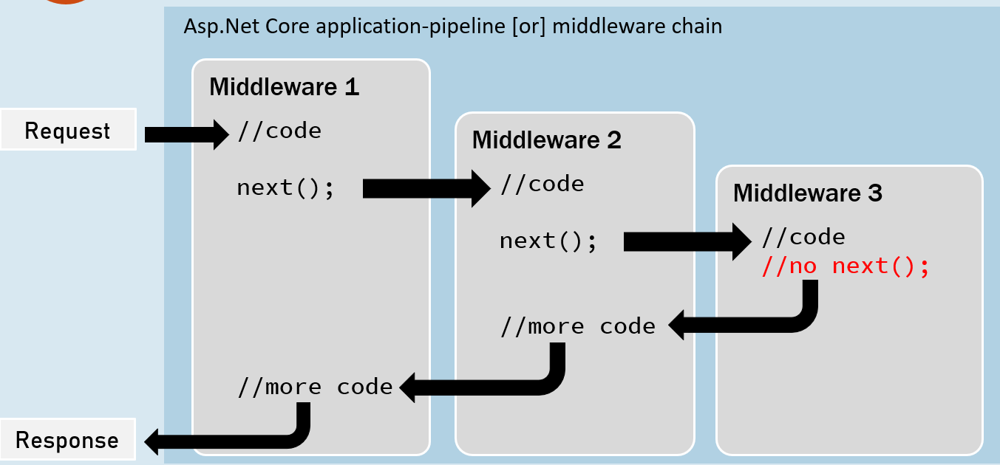
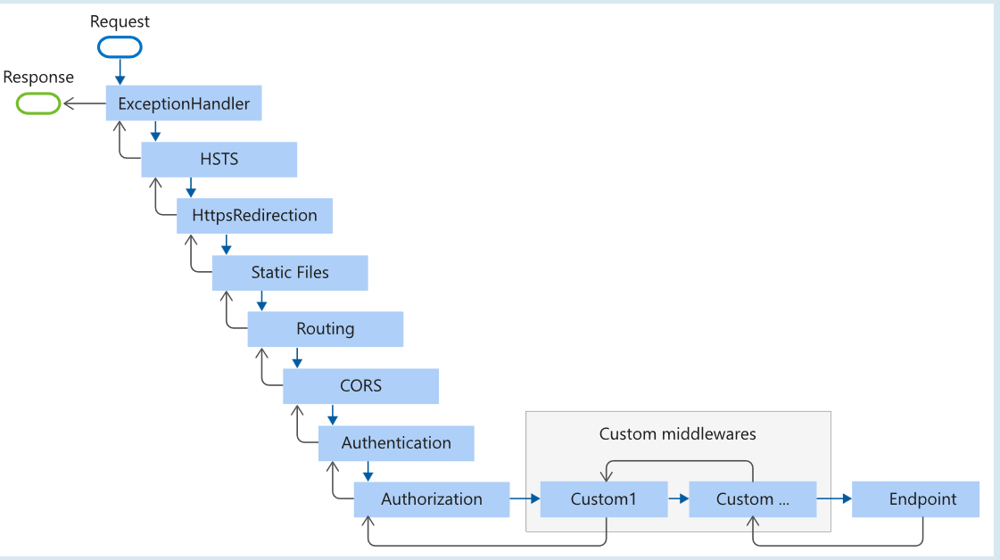

# Getting Started
In Visual Studio, in the create a new project screen, search for ASP.NET Core. Select what's more suitable for your needs and click next. The project name will be the name of your project but also a folder on the hard drive. By default the the sln file (solution) will be created with the same name. After clicking next, choose the framework, https and docker support. Choosing the ASP .NET Core empty template we'll see the basic minimum boiler plate (in Minimal apis top level statements) code to run a hello world.

        //1-create a builder which loads Configuration,Environment Settings and Services
        var builder = WebApplication.CreateBuilder(args);
        
        //2-with the builder, create an app (which is an instance of web application) in which we'll configure the middlewares of our app
        var app = builder.Build();

        //3-with the app, map all the incoming requests and return a message
        app.MapGet("/", () => "Hello World!");
        
        //4-run the app to start the server        
        app.Run();

## Browser Dev Tools
Press ctrl + shift + I and you will enter the dev tools, then Network.
If you press refresh, you'll see the request. Click on the request and see the details.
Click on the Http Response and you can see the object sent from the server to the browser.

## Kestrel and other servers
Kestrel is the default http server for asp.net core apps. Normally this is only used in dev. In prod we'll use reverse proxy servers as IIS, Nginx or Apache. These will receive the request and perform load balancing, url rewriting, authentication, caching, decompressing requests, decryption of ssl certificates,etc and only then transfer the request to the Kestrel server. In dev we can simulate the proxy server by using the IIS express (only on windows). When we run the project we can see a window of the cmd opening. That's the kestrel server instance. These will appear on the top with the play button.

## launchSettings.json
It's inside the Properties folder. There we can find the various launch profiles. A profile is a collection of settings which enables a particular server to run the application when we start the project. 
* "dotnetRunMessages" activates showing the changes resulting from dotnet cli command.
* "applicationUrl" shows the url and port. Ports must be between 1024 and 65536.
* "environmentVariables" global values that are available across the entire application

  

# Http
## Http Response Object

        app.Run( async (HttpContext context) => {
                context.Response.Headers["MyKey"] = "my value"; 
                context.Response.Headers["Content-Type"] = "text/html"; 
                context.Response.StatusCode = 200;
                await context.Response.WriteAsync("<h1>Hello World</h1>");
        });

        //structure
        http version / status code / status description  //Start Line
        Key : value //Response Headers 
        Key : value //Response Headers 
                //Empty line
        Response Body //Response Body

## HttpContext 
It's a type of object that gets created automatically upon receiving the request. 
Browser sends request => Kestrel server forwards the request to the app code => app code generates the httpContext containing request, response, etc

## StatusCode

        context.Response.StatusCode = ...

* 100-199: Informational
* 200 - Ok
* 201 - Created
* 204 - No Content
* 300-399 - Redirection
* 400 - Bad Request
* 404 - Not Found
* 409 - Conflict
* 500 - Internal Server Error

## Body - Content
* Html, css, xml, json
* blobs, etc

## Response Headers Dictionary 

        context.Response.Headers["MyKey"] = "my value"; 

* Date - Date and time of the response
* Server - Name of the server
* Content Type - MIME type of the response body ex: text/plain, text/html, application/json, application/xml, etc
* Content Length - Length in bytes of the response body (automatically set by the kestrel server)
* Cache-Control - Indicates nr of seconds the response can be cached at the browser. Ex: max-age=60
* Set-Cookie - Contains cookies to send to the browser. Ex: x=10
* Access-Control-Allow-Origin - Used to allow CORS (Cross-Origin-Resource-Sharing).Ex: http://www.example.com
* Location - Contains url to redirect
* Expires

## Http Request Object

        app.Run( async (HttpContext context) => {
                string path = context.Request.Path; (url in the start line)
                string method = context.Request.Method; (method in the start line)       
                
                context.Response.Headers["Content-type"] = "text/html";
                await context.Response.WriteAsync($"
{path}<\p>");
                await context.Response.WriteAsync($"
{method}<\p>");
        ...
        });

        //structure
        Method / Url (after the port nr)/ Http version  //Start Line
        Key : value //Request Headers
        Key : value //Request Headers
                //Empty line
        Request Body //Request Body (Empty in case of get method)

## Request Headers Dictionary 

        context.Request.Headers["MyKey"] = "my value"; 

* Accept - Contain MIME type of response content to be accepted by the client.Ex:text/html
* Accept-Language - Contain natural language of response content to be accepted by the client. Ex:en-US
* Content Type - MIME type of the request body ex: text/plain, text/html, application/json, application/xml, etc
* Content Length - Length in bytes of the request body (automatically set by the kestrel server)
* Date - Date and time of the request
* Host - Server domain name
* User-Agent - Browser details
* Cookie - Contains cookies to send to the server

## Request Methods
* GET - Requests to retrieve information, body is empty
* POST - Sends an entity object to the server, body has the data
* PUT - Sends an entity object to the server to fully update an already existing object.
* PATCH - Sends an entity object to the server to partially update an already existing object.
* DELETE - Deletes an object

## Query string
Syntax where you can send the param values in the request to the server.
* "?" - separator from the url and the query
* "&" - separator from the key value pairs

        GET /dashboard?id=1&name=scott HTTP/1.1 

        Host: www.website.com
        Accept: text/html
        ...

The query is stored on the context.Request.Query dictionary.
To prepare the response from the server, we can access the method and query like so:

        app.Run(async (HttpContext context) => 
        {
                if(context.Request.Method == "GET")
                {
                        if(context.Request.Query.ContainsKey("id"))
                        {
                                string id = context.Request.Query["id"];
                                await context.Response.WriteAsync(id);
                        }
                }
        });

## Read a Request Body
Body is a stream so we must use StreamReader in case of plain text.

        app.Run( async (HttpContext context) => 
        {
                StreamReader reader = new StreamReader(context.Request.Body);
                string body = await reader.ReadToEndAsync();
        });     

Example with a query string sent in a body=raw by postman "firstName=scott&age=20": 

        app.Run( async (HttpContext context) => 
        {
                StreamReader reader = new StreamReader(context.Request.Body);
                string body = await reader.ReadToEndAsync();

                //parsing the string to dictionary
                Dictionary<string, stringValues*> queryDict = QueryHelpers.ParseQuery(body); 

                if(queryDict.containsKey("firstName"))
                {
                        string firstName = queryDict["firstName"][0];
                        await context.Response.WriteAsync(firstName);
                }
        });     

\* here there's a possibility that the query can bring duplicate keys, and in this way we agglomerate the potential different values to the same key.        

  

# Middlewares
Component that is assembled into the app pipeline to handle requests and responses. They're chained one after the other and execute in the same sequence how they're added.

Each middleware is responsible for a single operation
They can be a request delegate (anonymous method or lambda expression) or a class.

In case that one middleware doesn't forward the request to the next middleware we call it short-circuiting middleware.

We can create a short-circuiting or terminating middleware with the app.Run (because it doesn't forward the request to subsequent middlewares) and pass it a lambda like this:

        //app.Run doesn't forward the request
        app.Run( async (HttpContext context) => 
        {
                await context.Response.WriteAsync("This request will end here when you'll receive this message");   
        });     

## Middleware chain
To forward the request to the 2nd middleware we must pass a 2nd param to the lambda RequestDelegate called next. This will point to the next middleware.
Inside the lambda, we await the "next" and pass it the context. In summary: 1st point to the next middleware,2º pass the context to it by arg.

        //Middleware1 using Use method
        app.Use( async (HttpContext context, RequestDelegate next) => 
        {       
                //before logic
                await context.Response.WriteAsync("Hello");   
                await next(context);

                //after logic
                //Do something
        });
        //Middleware2 using Run method (short-circuiting)
        app.Run( async (HttpContext context) => 
        {
                await context.Response.WriteAsync("Hello again");   
        });     

The chain looks like this:

## Custom Middleware Class
Used to separate the middleware logic from a lambda to a reusable class.
Has to implement IMiddleware which forces us to implement the InvokeAsync method, like so:

        class MiddleWareClassName : IMiddleware
        {
                public async InvokeAsync(HttpContext context, RequestDelegate next)
                {
                        //before logic
                        await next(context);
                        //after logic
                }
        }

Now we have to register this custom class as a service.
On program.cs and before the Build method:

        builder.Services.AddTransient<MiddleWareClassName>();

And after the app is built. We can:

        app.UseMiddleware<MiddleWareClassName>();

NOTE! Its common convention to prefix middleware implementing methods as Use...

## Custom Middleware Extensions
To be able to call app.MyCustomMethod(), create an extension method for the app (of WebApplication type)

        public static class MyCustomMiddlewareExtension
        {
                public static IApplicationBuilder UseMyCustomMiddleware(this IApplicationBuilder app)
                {
                    return app.UseMiddleware<MyCustomMiddleware>();         
                }
        } 

        //on program.cs
        app.UseMyCustomMiddleware();

## Custom Conventional Middleware (Not extending IMiddleware)
We can create a custom middleware without inheriting from IMiddleware, but manually implementing the InvokeAsync method necessary. The difference is that we receive the next by the constructor.
We can also use template to add middleware when adding in the solution object.

        class MiddlewareClassName
        {
                private readonly RequestDelegate _next;

                public MiddlewareClassName(RequestDelegate next)
                {
                        _next = next;
                }
                public async Task InvokeAsync(HttpContext context)
                {
                        //before logic
                        await _next(context);
                        //after logic
                }
        }

## Middleware order

1. app.UseExceptionHandler();
2. app.UseHsts();
3. app.UseHttpsRedirection();
4. app.UseStaticFiles();
5. app.UseRouting(); => Identifying action method based route
6. app.UseCors();
7. app.UseAuthentication(); => Reading Identity Cookie
8. app.UseAuthorization(); => Validates access permissions of the user
9. app.UseSession();
10. app.MapControllers(); => Executes the filter pipeline (action + filters)
11. app.UseOurOwnCustomMiddlewares();
12. app.Run();

## app.UseWhen (Branching middleware pipeline)
We can use conditions to direct the flow of middlewares.
We have to pass 2 args: the condition that returns true or false and the middleware we want to execute in case of true.

        app.UseWhen( 
                context => context.Request.Query.ContainsKey("username"),
                app => {
                        //This only runs if the condition is true
                        app.Use( async (context, next) => {
                                await context.Response.WriteAsync("Hello from Middleware branch");
                                await next(context);
                        });
                }
        );
        //This runs always
        app.Run( async (context) => 
        {
                await context.Response.WriteAsync("Hello from main chain");
        });

  

# Routing
Process through which the app matches the requested url path and executes the related controller and Action.
This is accomplished by 2 calls:

* app.UseRouting(); (selects) //enables the routing and selects the appropriate endpoint based on the url path and http method
* app.UseEndpoints(); (executes) //executes the appropriate endpoint based on what was selected by the UseRouting() method

        app.UseEndpoints(endpoints => 
        {
                endpoints.Map("map1", async (context) => {
                        await context.Response.WriteAsync("In Map1");
                });
                endpoints.Map("map2", async (context) => {
                        await context.Response.WriteAsync("In Map2");
                });
        });
        //Map() method maps all the methods (ex Get, Post)
        //MapGet() to only map get methods
        //MapPost() to only map post methods

        //in case of none of the endpoints above get called
        app.Run( async context => {
                await context.Response.WriteAsync("Request received at + " context.Request.Path); //output: Request received at /
        });
        app.Run();

        public class AppointmentController : Controller
        {       
                //http://localhost:.../Appointment/Index
                public IActionResult Index()
                {
                        return View();
                }
                //http://localhost:.../Appointment/Details/1
                public IActionResult Details(int id)
                {
                        return Ok("You have entered id: " + id);
                }
        }

## GetEndpoint()
After the app.UseRouting(); executes, he has selected the current request endpoint. We can retrieve it by calling the GetEndpoint method. (logically only after appUseRouting is called, otherwise it will return null)

        app.Use( async (context, next) => 
        {
                Endpoint? endpoint = context.GetEndpoint();
                if(endpoint != null)
                {
                        await context.Response.WriteAsync($"Endpoint: {endpoint.DisplayName}");
                }
        });
        app.Run();

## Route params
url literal  
http://localhost:1337/Home/Index

url with route params  
http://localhost:1337/{Controller}/{Action}/{id}

{Controller} => this param will be replaced by the controller name  
{Controller=Home} => this param has a default value of Home  
{Action} => this param will be replaced by the action name  
{id} => this param will be replaced by the id of the object  
{id?} => this param is optional  

        app.UseEndpoints( endpoints => 
        {
                endpoints.Map("files/{filename}.{extension}", async context => {
                        await context.Response.WriteAsync("In files");
                });
        });

Now on the browser if we make the request localhost.../files/sample.txt this endpoint will be selected and the response sent.

To access the route values passed in through the url we can:

        Dictionary<string,object> myRouteValues = context.Request.RouteValues

        //or
        if(context.Request.RouteValues.ContainsKey("filename"))
        {
                string? fileName = context.Request.RouteValues["filename"].ToString();
        }
        
## Route constraints
Restraint the datatype of args we can supply on the url.
In case of not matched, it will go to another endpoint.

        {id:int} => this param must be of type int

We can have constraints of type:
* int // ex: {id:int}
* bool // ex: {active:bool}
* datetime // ex: {created:datetime}
* decimal // ex: {price:49.99}
* long // ex: {x:1234567}
* guid // ex: {id:123e456-e89....}

We can have constraints in length:
* minlength(value) //ex: {employeeName:minlength(3)}
* maxlength(value)
* length(min,max)

ex: // an arg passed of employeeName that is min 3 chars and max of 7 and defaults to John in case of not passed

        app.UseEndpoints( endpoints => 
        {
                endpoints.Map("employee/profile/{employeeName:length(3,7)=john}", async context => {
                        context.Response.WriteAsync("Something");
                });
        });

We can have constraints of range of chars:
* min()
* max()
* range(min,max) => {age:18,120}
* alpha  => {username:alpha} Matches with a string that contains only (A-Z) and (a-z)
* regex  => {age:regex(^[0-9]{2}$)}

ex: an arg passed of sales report that takes in the year and next only quarterly months like sales-report/2030/apr

        app.UseEndpoints( endpoints => 
        {
                endpoints.Map("sales-report
                /{year:int:min(1900)}
                /{month:regex(^(apr|jul|oct|jan)$)}", 
                async context => {
                        int year = (int)context.Request.RouteValues["year"]
                        string? month = context.Request.RouteValues["month"].ToString();
                        await context.Response.WriteAsync($"The report of {year}, of the semester {month} is ready.");
                });
        });

## Custom Route constraints
In case you have to use a complex constrain in a lot of places, create a custom route constraint class to check the url args. It implements the interface IRouteConstraint which has a method Match.

        public class MyCustomConstraintClass : IRouteConstraint
        {
                //sales-report/2030/apr
                public bool Match(HttpContext? context, IRouter? route, string routeKey, RouteValueDictionary values, RouteDirection routeDirection)
                {
                        //check if value exists
                        if (!values.containsKey(routeKey)) //month
                        {
                                return false; //not a match
                        }
                        Regex myRegex = new Regex("^(apr|jul|oct|jan)$)";
                        string? monthValue = values[routeKey].ToString();
                        return myRegex.IsMatch(monthValue);
                }
        }

Now we have to add this class to the builder in the program.cs

        builder.Services.AddRouting(options => 
        {
                options.ConstraintMap.Add("myMonthsConstraint", typeof(MyCustomConstraintClass));
        });

And bellow:

        app.UseEndpoints( endpoints => 
        {
                endpoints.Map("sales-report/{year:int:min(1900)}
                /{month: myMonthsConstraint}, 
                async context => {
                        ...
                });
        });

## Endpoint Selection Order
1. Url template with more segments 
// a/b/c/d is higher than a/b/c

2. Url template with literal text has more precedence than a param segment
// a/b is higher than a/{parameter}

3. Url template that has a param segment with constraints has more precedence than param segments without constraints
//a/{b}:int is higher than a/{b}

4. Catch-all params have less
//a/{b} is higher than a/**

## UseStaticFiles()
wwwroot - Stores static files (css, js scripts, libraries, photos, logos,favicons, etc).
It's use is enabled on the Program.cs with the line "app.UseStaticFiles();"

We should have a folder wwwroot for serving static files.
We can change the name to anything but then we have to change the statement:

        var builder = WebApplication.CreateBuilder(new WebApplicationOptions(){
                WebRootPath = "myCustomRoot";
        });

We can have multiple static serving folders if necessary: 

        app.UseStaticFiles(); //this is now pointing to the myCustomRoot folder
        app.UseStaticFiles(new StaticFileOptions(){
                FileProvider =  new PhysicalFileProvider(
                        Path.Combine(builder.Environment.ContentRootPath,"myCustomRoot2");
                ); 
        });

add the statement in program.cs

        app.UseStaticFiles();

and now on the browser we can access it directory via url.

  

# Controllers
Used to group a set of actions(or action methods) 
Invokes the action based on the route and fetches data from the model to render on the view.
To create a controller, we can create from template or create a class and then extend the Controller class.(Name must end in Controller).

        public class HomeController : Controller
        {
                [Route("sayHello")] //attribute routing
                public IActionResult SayHelloMethod()
                {
                        return Ok("Hello World");
                }
        }

We must also add the controller to the service di and enable the routing for the step.

        //In the program.cs..
        ...
        builder.Services.AddControllers(); //all the controller classes are added as services automatically
        var app = builder.Build();

        app.MapControllers(); //takes the routes and maps them automatically
        app.Run();

Types of Endpoints:
* MVC
* Razor Pages
* SignalR

## Multiple Action methods
One action method can have multiple routes ex:

        [Route("sayHello")]
        [Route("sayHello2")]
        public IActionResult MyMethod()
        {
                return Ok("2 routes can call this method");
        }

We can also pass route params like so:

        [Route("contact/{mobile:int"})]
        public IActionResult MyMethod()
        {
                return Ok("constraint to only accept int");
        }

## Identification of controller
Both or either must be implemented to the compiler acknowledge the controller.

* Decorate the class with the [Controller] tag
* Name the class with the suffix Controller, ex: HomeController.cs

## Responsibility of controllers
* Reading requests - Extracting data values from requests. 
* Validation - Validate incoming request details.
* Invoking Models - Calling business logic methods available as services
* Preparing response

## Content Result
Type of action result

        public ContentResult Index()
        {
                return new ContentResult()
                {       
                        Content = "Hello", //body of response
                        ContentType = "text/plain"  //header of the response
                }
        }

or using the Content method:

        public ContentResult Index()
        {
                return Content("Hello","text/plain");
        }

## JSON Result
Way to return a json object

        [Route("person")]
        public JsonResult Person()
        {
                Person person = new Person() {
                        Id = Guid.NewGuid(),
                        FirstName = "James"
                }
                return new JsonResult(person);
                //or
                return Json(person);
        }

## File Result
Way to return a file to the browser. There are 3 types of file results:

* VirtualFileResult (when the file is in the wwwroot folder)

        //we must add the app.UseStaticFiles() at program.cs
        
        //In the controller
        public VirtualFileResult FileDownload()
        {
                return new VirtualFileResult("/sample.pdf","application/pdf");
                //or
                return File("/sample.pdf","application/pdf");
        }

* PhysicalFileResult - when the file is outside the wwwroot folder, on the hard drive

        //we must add the app.UseStaticFiles() at program.cs
        
        //In the controller
        public PhysicalFileResult FileDownload()
        {
                return PhysicalFile("path to where the file is on the hard drive","application/pdf");
        }

* FileContentResult (when retrieving a byte array of the file)

        //we must add the app.UseStaticFiles() at program.cs
                
        //In the controller
        public FileContentResult FileDownload()
        {
                byte[] bytes = System.IO.File.ReadAllBytes("c:\..");
                return File(bytes,"application/pdf");
        }

## IAction Result
It's recommended to return always IActionResult because it's the parent of all the result classes.

* Status code results

        return Ok(); (200)
        return Created() (201)
        return NoContent() (204)
        return BadRequest() (400)
        return Unauthorized() (401)
        return NotFound() (404)
        return new UnsupportedMediaTypeResult() (415)

* Status code w/ object results

        //OkObjectResult
        var result = new OkObjectResult(new {message = "200 OK", currentDate = DateTime.Now});
        return result;

        //CreatedAtActionResult 
        Automatically sets the statusCode to 201 Created and it includes the newly created object as response body and in the headers it sends the location of the new object
        var result = new CreatedAtActionResult("createdobjectresult","statuscodeobjects","", new {message = "201 Created", currentDate = DateTime.Now});
        return result;

        //Bad Request
        var result = new BadRequestObjectResult(new {message = "400 Bad Request", currentDate = DateTime.Now});
        return result;

        //Not Found
        var result = new NotFoundObjectResult(new {message = "404 Not Found", currentDate = DateTime.Now});
        return result;

* Redirect results

        //Redirect
        return Redirect("https://www.google.com");

        //Local Redirect
        return LocalRedirect("/redirects/target");

        //Redirect to Action
        return RedirectToAction("target","Appointments");

* File results

        //FileResult
        return File("~/downloads/pdfSample.pdf", "application/pdf");

        //File Content Result
        var pdfBytes = System.IO.File.ReadAllBytes("wwwroot/downloads/pdf-sample.pdf");
        return new FileContentResult(pdfBytes,"application/pdf");

        //Virtual File Result
        return new VirtualFileResult("/downloads/pdf-sample.pdf","application/pdf")

        //PhysicalFileResult
        return new PhysicalFileResult(_IHostingEnvironment.ContentRootPath + "/wwwroot/downloads/pdf-sample.pdf", "application/pdf");

* Content results

        //return a view
        return View();

        //return a partial
        return PartialView();

        //return a json
        return Json(new {message = "json result", date = DateTime.Now});

        //return content
        return Content("Here's the contentResult message"); 
        //(can be html)

# Model Binding
Reads values from requests and pass them as arguments automatically to the action method. 
Priority for the model binding:
1. Form fields (form url encoded or form data sent in the body)
2. Request body
3. Route data (controller,action,id supplied through the url)
4. Query string params (query supplied through the url)

## Form Fields
In case of x-www-form-urlencoded, it will send it through query string in the body. In case of form-data it will send a hashed form in the body (used when the form has more than 10 fields or when we have to attach files).
        
## Request Body
On a post request, sends the data in the body. We have to explicitly add the attribute [FromBody] to inform the model binding.

        public IActionResult Index([FromBody] Person person)
        {}

To send the post request, we can select raw to send Json or xml.

### Input formatter
Internal classes that convert the request body into the model object
By default there's already a json input formatter, but if we want a xml, we have to add an xmlserializer input formatter.

        //on the program.cs
        builder.Services.AddControllers().AddXmlSerializerFormatters();

## Route Data
We can explicitly enforce it by [FromRoute] as origin of each param, or in the model class property to be always taken from route regardless of the method

        //request to: .../bookstore/1/false
        [Route("bookstore/{bookid?}/{isloggedin?}")]
        public IActionResult Index(int? bookId, bool? isLoggedIn)
        {
                if(!bookId.HasValue)
                {
                        return BadRequest("...")
                }
        }
        //output bookid = 1, isloggedin = false

## Query string
We can explicitly enforce it by [FromQuery] as origin of each param, or in the model class property to be always taken from query regardless of the method

        //request to: .../bookstore?bookid=10&isloggedin=true
        public IActionResult Index(int? bookId, bool? isLoggedIn)
        {
                if(!bookId.HasValue)
                {
                        return BadRequest("...")
                }
        }
        //output bookid=10, isloggedin = true

## Header Data
We can read data from the request headers:

        ControllerContext.HttpContext.Request.Headers["key"]

Or we can bind the model data when entering the action:

        public IActionResult Index(Person person, [FromHeader( Name = "User-Agent")] string UserAgent)
        {} 

## Model Validations
On the class model, we can annotate the rules of validation.

        [Required(ErrorMessage= "{0} can't be empty or null")]
        [Display(Name = "Person name")]
        [StringLength(40, MinimumLength = 3, ErrorMessage = "{0} between {2} - {1} chars")]
        [RegularExpression("^[A-Za-z .]*$", ErrorMessage = "{0} should contain only alphabetic, spaces and dots")]
        public string? PersonName {get; set;}

        [EmailAddress(ErrorMessage = "{0} should be a valid email address")]
        public string? Email {get; set;}

        [Phone(ErrorMessage = "{0} should be a valid phone nr")]
        public string? Phone {get; set;}

        [Password]
        public string? Password {get; set;}

        [Compare(nameof(Password), ErrorMessage = {0} and {1} don't match)]
        public string? ConfirmPassword {get; set;}      

        [Range(0,999.99, ErrorMessage="{0} should be between ${1} and ${2}")]
        double? Salary {get; set;}

        //more tags
        [Url] => to pass an url
        [ValidateNever] => to disable validation in a prop

## Model State
Prop of controller that exists in every controller and groups the data on the model validations.
* IsValid - if at least one validation failed or not
* Values - Contains each model prop value with corresponding errors prop which is a list of validation errors.
* ErrorCount - Returns nr of errors

Its common to return a BadRequest with a list of validation errors:

        if(!ModelState.IsValid)
        {
                List<string> errorsList = new List<string>();

                foreach(var value in ModelState.Values)
                {
                        foreach(var error in value.Errors)
                        {
                                errorsList.Add(error.ErrorMessage);
                        }
                }
                //or with linq
                errorsList = ModelState.Values.SelectMany( value => value.Errors).Select(err => err.ErrorMessage).ToList();

                return BadRequest(errorsList);

                //or returning a single string
                return BadRequest(string.Join("\n",errorsList));
        }
        
## Custom Model Validation
To create our custom model validation we must extend ValidationAttribute and override the method IsValid.
Validating min year of birth:
        
        // In the model class 
        [MinimumYearValidator(2002)]
        public DateTime? DateOfBirth {get; set;}

        //In the newly created attribute class
        public class MinimumYearValidatorAttribute : ValidationAttribute
        {
                public int MinimumYear {get;set} = 2000;
                public string DefaultErrorMessage {get; set;} = "Year shouldn't be less than {0}";

                public class MinimumYearValidationAttribute(int minYear)
                {
                        MinimumYear = minYear;  
                }

                protected override ValidationResult? IsValid(object? value, ValidationContext validationContext)
                {
                        if(value != null)
                        {
                                Datetime date = (DateTime) value;
                                if(date.Year >= MinimumYear)
                                {
                                        return new ValidationResult(ErrorMessage ?? DefaultErrorMessage);
                                }
                                return ValidationResult.Success;
                        }
                        return null;
                }
        } 

### Custom Validation with multiple properties
We'll need to override the IsValid method of the ValidationAttribute class.

        //in the model class
        public DateTime? FromDate {get;set}
        
        [DateRangeValidator(nameOf(FromDate), ErrorMessage="Should be older than or equal to ToDate")]
        public DateTime? ToDate {get;set}

        //on the newly created validator class
        public class DateRangeValidatorAttribute: ValidationAttribute
        {
                public string OtherPropName {get; set;}

                public class DateRangeValidatorAttribute(string otherPropName)
                {
                        OtherPropName = otherPropName;
                }

                protected override ValidationResult? IsValid(object? value, ValidationContext validationContext)
                {
                        if(value != null)
                        {       
                                Datetime toDate = (DateTime) value;

                                PropertyInfo? otherProperty = validationContext.ObjectType.GetProperty(OtherPropName);
                                DateTime fromDate = Convert.ToDateTime(otherProperty.GetValue(validationContext.ObjectInstance));

                                if(fromDate > toDate)
                                {
                                        return new ValidationResult(ErrorMessage, new string []{OtherPropName, validationContext.MemberName});
                                }
                                return ValidationResult.Success;
                        }
                        return null;
                }
        }

## IValidatable Object
To create a model validation specific to a model class. Not reusable approach.
Executes only at the end of all the other normal validations.
Extend the IValidatable interface and implement it's method Validate.

        //requirement either age or dateOfBirth are sent in via args

        //on the Validate Method
        public IEnumerable<ValidationResult> Validate(ValidationContext validationContext)
        {
                if(!DateOfBirth.HasValue && !Age.HasValue)
                {
                        yield return new ValidationResult("Either Date of Birth or Age must be supplied, new[]{nameof(Age),nameof(DateOfBirth)});
                }
                if(....) yield return...
        }

## Bind & BindNever
Specifies that only the attributes specified should be included in the model binding. Discards all the others that were submitted in the request. Prevents overposting unwanted props.

        public IActionResult Index([Bind(nameof(Person.PersonName), nameof(Person.Email))]Person person)
        {}

If you have just some props you don't want to include:

        class ModelClassName
        {
                [BindNever]
                public DateTime DateOfBirth {get;set;}
        }

## Custom Model Binding
Whenever the object is too complex to the default model binder.
Extend IModelBinder that implements BindModelAsync.
In the example we want to create a custom model binder that joins firsName and lastName props as a person.PersonName

        //in the controller
        public IActionResult Index([FromBody] [ModelBinder(BinderType = typeof(PersonModelBinder))] )

        //in the binder class
        public class PersonModelBinder : IModelBinder
        {
                public Task BindModelAsync(ModelBindingContext bindingContext)
                {
                        Person person = new Person();

                        //for prop personName
                        if(bindingContext.ValueProvider.GetValue("FirstName").Length > 0)
                        {
                                person.PersonName = bindingContext.ValueProvider.GetValue("FirstName").FirstValue;

                                if(bindingContext.ValueProvider.GetValue("LastName").Length > 0)
                                {
                                        person.PersonName += " " + bindingContext.ValueProvider.GetValue("LastName").FirstValue;
                                }
                        } 
                        //for prop Email
                        ...
                        //for prop DateOfBirth
                        ...
                        bindingContext.Result = ModelBindingResult.Success(person); 
                        return Task.CompletedTask;
                }
        }

## Custom Model Binder Provider
To use the same custom model binder to all the action methods for ex, we could declare it globally by creating a custom model binder provider. In that case we don't have to annotate explicitly every action (as long its params receive the class object we want to model) with the attribute [ModelBinder(BinderType = typeof(PersonModelBinder))]

        public class PersonBinderProvider : IModelBinderProvider
        {
                public IModelBinder? GetBinder(ModelBinderProvider context)
                {
                        if(context.Metadata.ModelType == typeof (Person))
                        {
                               return new BinderTypeModelBinder(typeof(PersonModelBinder));
                        }
                        return null;
                }
        }
        //and now we register it as a service in program.cs
        builder.AddControllers(options => 
        {
                options.ModelBinderProviders.Insert(0, new PersonBinderProvider()); //index 0 to be the first model to bind
        });

## Collection Binding
To be able to receive a collection in the request body, the default model binder will group multiple fields (as long as they have the same name and the index) into the Tag list automatically.

        //in the model class
        public List<string?> Tags {get; set;} = new List<string?>();

        The request has the body:
        Tags[0] => "#dotnet"
        Tags[1] => "#python"

  

# Views
It's the UI. Contains the markup(Razor Syntax). Renders the model data passed by a controller. We can write C# in the view thanks to the razor engine. The typical view is strongly typed, with its type being stated in the top line of its code as @model IEnumerable\<Item>. If a ViewBag is introduced, then it becomes weakly typed.(more than 1 type)
To continue with more than 1 type var but still maintaining the strongly type view, we use viewModels.
To enable the controllers and views as a service we must add in the program.cs

        builder.Services.AddControllersWithViews();

So they are instantiated whenever we send a request.
And to return a view, inside the controller.

        public IActionResult Index()
        {
                return View(); //Views/Home/Index.cshtml
                //or
                return View("abc") //abc.cshtml
        }

The view is expected to be inside a folder called Views and inside a folder with the controller name without suffix.
To create a view, we can create it manually as in SolutionOptions/Add/View/Razor-view empty/add, or we can click the action method name in the controller and click add view.

## Razor Code blocks
We can add multiple code blocks or expressions inside the view file

        @using ....
        @* this is how we comment *@

        @{
                //razor code block
        }

        @Expression or @(Expression)

        @if (condition) 
        {
                ...
        } 

        @if (condition)
        {
                ...
        }
        else 
        {
                ...
        }

        @switch (variable) 
        {
                case value1: break;
                case value2: break;
                default: break;
        }

        @foreach (var person in people)
        {
                

                        @person.Name
                        @person.Age
                

        }

        @for (int i = 0, i < people.Length ; i++)
        {
                Person person = people[i];
                

                        @person.Name
                        @person.Age
                
 
        }

        //create a literal inside the c# code block to write html:
        @: static text

        //or
        <text>static text</text>

## Razor local functions

        //To create a local function
        @{
                return_type MethodName(arguments)
                {}
        }
        //To create a method
        @functions{
                return_type MethodName(arguments)
                {}
        }
        //To call it
        @GetAge(person.DateOfBirth)

## Html.Raw
To save html code or javascript into a var and write it into the html without sanitization.

        string alertMessage = $"";

        //to call it
        @Html.Raw(alertMessage);

## ViewData
Used to supply the data from the controller to the view. Its a dictionary with kv pairs <*string><*object>.
It must be type cast before used on the view

        //In the controller
        public IActionResult Index()
        {       
                ViewData["pageTitle"] = "Asp.net core demo app";
                return View();  
        }
       //inside the view
        @ViewData["pageTitle"]

## ViewBag
Wrapper around ViewData accessing the same data but as it is dynamic it's not necessary to typecast. 

        //In the controller
        public IActionResult Index()
        {       
                ViewData["pageTitle"] = "Asp.net core demo app";
                //or
                ViewBag.pageTitle = "Asp.net core demo app";
                return View();  
        }
       //inside the view
        @ViewData.pageTitle
        or
        @ViewBag.pageTitle

* ViewBag is one of the ways of passing data from a action method to a view
* It's a dynamic property of the controller base class
* It only goes from controller to view, not the other way around
* Can be assign with any number of properties and values
* It's life lasts during the current http request. It will be null if redirection occurs.

## Strongly typed views
It's bound to a model class. Allows direct access to a prop of the model class.

        //on the controller we pass the object of the model type class as an arg
        IEnumerable<Person> people = new IEnumerable<Person>();
        ...
        return View("Index", people);

        //on the top of the view we declare the model type
        @model IEnumerable<Person>

        //To call it (Model with a capital M because it's a property)
        @foreach (Person person in Model)
        {}

## ViewModel - Strongly typed views with multiple models
We create a class with 2 or more types.  
Ex problem: We have 2 models that we want to pass in to the view Product and Person.

        //We create a ViewModel Class
        public class ProductPersonViewModel
        {
                public Product ProductData {get; set;}
                public Person PersonData {get; set;}
        }
        //In the controller
        public IAction Result PersonWithProduct()
        {
                Person person = new Person() {...};
                Product product = new Product() {...};

                ProductPersonViewModel personWithProduct = new ProductPersonViewModel()
                {
                        PersonData = person;
                        ProductData = product;
                }
                return View(personWithProduct);
        }
        //On the view and on top we declare the type of model
        @model ProductPersonViewModel

        //and to use it.
        ...@Model.PersonData.Name... 
        or
        ...@Model.ProductData.Price...

## _ViewImports.cshtml
In almost all view files we're constantly importing the models.
To do that globally we can create a file inside the Views folder called _ViewImports.cshtml which is a partial and will automatically import everything in that file to all the views in the project.

        //In the file
        @using ViewsExample.Models

This works because when we call the return View() method on a action, it calls the global viewImports, and then the local ViewImports and then the actual view.

## Shared Views
If we place a view file in the "Shared" folder of the views, this file will be accessible for all the controllers.

## Layout Views
It's responsible for containing logic template for all the views.
Create a razor layout with the partial prefix "_" on the shared view folder.
When creating a view, invoke the layout.

        @{
                Layout = "~/Views/Shared/_Layout.cshtml";
        }

In the layout view we also can access the ViewData. It's commonly used to show the page Title, and then each view defines it's value on the dictionary like so:

        //on each single view
        @{
                Layout = "~/Views/Shared/_Layout.cshtml";
                ViewData["Title"] = "Products Page";
        }

        //on the layout
        <title>@ViewData["Title"].ToString()</title>

## _ViewStart.cshtml
A partial view that declares the layout globally. As _ViewImports does to the using statements, the _ViewStart does to the layout. And just like _ViewImports, it works globally if located in the Views folder and locally (to the controller) if placed on the controller related views folder. Add the layout statement to viewStart:

        @{
                Layout = "~/Views/Shared/_Layout.cshtml";
        }

## Dynamic Layout view
We'll set the value of the layout after analyzing some condition.
In this example we'll set the layout in case a value was passed in the url

        //in the controller
        [Route("search-products/{ProductId?}")]
        public IActionResult Search(int? ProductId)
        {
                ViewBag.ProductId = ProductId;
                return View();
        }
        //In the view
        @{
                if(ViewBag.ProductId != null)
                {
                        Layout = "~/Views/Shared/_ProductsLayout.cshtml";
                }
                else
                {
                        Layout = "~/Views/Shared/_Layout.cshtml";
                }
        }

## Layout Sections
You can create multiple section per layout view.
To create a specific section to a couple of pages, (ex a sidebar that only appears in some pages or a custom footer for other pages).

        //In the views 
        @section myCustomSection
        {
                
This is my specific section
      
        }
        //In the layout we must call for the section rendering
        @RenderSection("myCustomSection, false); //2nd param (required) must be false, otherwise all the views must pass in a section with the same name

## Nested Layout Views
Rare to use in real projects. Its a layout that calls other layouts.

## Partial Views
Similar to layouts but intended for smaller blocks of html.
It also supports ViewData
We create the partial view as a normal razor view with the prefix "_" in its name and place it on the "Shared" views folder.
As tag helpers are not enabled by default we must create (if not created yet) a _ViewImports and add the statement.

        @addTagHelper "*; Microsoft.AspNetCore.Mvc.TagHelpers"

And on any view, to invoke it we can:

        //invoke via html
        <partial name="_MyPartialView"/> //returns content to the parent view
                       
        //invoke via Razor syntax
        @await Html.PartialAsync("_MyPartialView"); //returns content to the parent view

        //or
        @{
                await Html.RenderPartialAsync("_MyPartialView"); //streams content directly to the browser
        }

The ViewData is copied automatically from the view to the partial.

## Partials with ViewData
We can pass in a specific ViewData Object:

        //on the view
        var myViewData = new ViewDataObjectDictionary(ViewData);

        myViewData["ListTitle"] = "Countries";

        <partial name=partialView> view-data="myViewData"/>

        //or

        @await Html.RenderPartialAsync("partialView",myViewData);

## Partials (strongly typed)
We can also make it a strongly typed partial view:

        //model class
        public class ListModel
        {
                public string ListTitle {get; set;} = string.Empty();
                public List<string> ListItems {get; set;} = new List<string>
        }
        //In the view, pass the model to the partial
        @{
                ListModel listModel = new ListModel();
                listModel.ListTitle = "Countries";
                listModel.ListItems = new List<string>(){
                        "USA",
                        "Canada",
                        ...
                }
        }

        <partial name="_MyPartialView" model="listModel"/> //here is important to pass the model to the partial

        //In the partial, declare the type on top
        @model ListModel
        ...
        //and then using...
        @Model.ListTitle //output "Countries"

## PartialViewResult
We can also return a PartialViewResult
To make some partial appear asynchronously in the html driven by an user event.
This way we download the html dynamically only when some parts are needed. The page in the browser isn't refreshed, only added html.

Ex:
A button when you click loads in the same page a list of programming languages.
Instead of following an hyperlink, we want to call a specific endpoint through javascript to add the response asynchronously to the html and show the list.
1st we have to send the html response with the view, the button and the script to fetch the action response.
2nd controller must have the action that returns a PartialViewResult that contains the list.

        //in the view
        <button type="button" id=button-load">Load Programming Languages</button>

        

        

        

        //in the controller
        [Route("programming-languages")]
        public IActionResult ProgrammingLanguages()
        {
                ListModel listModel = new ListMode()
                {
                        ListTitle = "Programming Languages List",
                        ListItems = new List<string>()
                        {
                                "Python",
                                "C#",
                                "Go"
                        }
                };
                return PartialView("_ListPartialView", listModel)
        }
        // and on the partial view we have the razor with a div foreach list item

 ## View Component
View components are similar to partial views, but they don't use model binding, they depend on the data passed when calling the view component.
* It renders a chunk rather than a whole response.
* Has same separation-of-concerns and testability between controller and view.
* Can have parameters and business logic.
* Typically invoked from a layout page.
* Intended where reusable rendering logic that is too complex for a partial view, such as:
* Dynamic navigation menus
* Tag cloud, where it queries the database
* Sign in panel
* Shopping cart
* Recently published articles
* Sidebar content on a blog
* A sign in panel that would be rendered on every page and show either the links to sign out or sign in, depending on the sign in state of the user

 

It consists of two parts:
1. The class, typically derived from ViewComponent.
2. The result it returns, typically a view.

 

To create a view component:
1. Create a folder "ViewComponents"
2. Create a class file and suffix the name ViewComponent ex HomeViewComponent, or decorate the class with the tag ViewComponent
3. Extend the ViewComponent class
4. Implement the method public async Task<\IViewComponentResult> InvokeAsync() and return View() (if the view component doesn't have the default name, we must pass its name through the arg of the View() method).
5. Add a new folder inside the shared called "Components" and inside a folder of the name of the view component class without the suffix (in the same ex: Home) and inside a file a file called Default.cshtml.
6. In the default file, create a simple h1 tag saying "view component invoked" just for testing purposes.
7. In the view, add @await Component.InvokeAsync("Home") where we want to load whatever is in default.cshtml
8. Optionally we can also invoke the viewComponent through tag helper

        //the vc class
        public class GridViewComponent : ViewComponent
        {
                public async Task<IViewComponentResult> InvokeAsync()
                {
                        return View() //invokes Views/Shared/Components/Grid/Default.cshtml
                }
        }
        //in the view
        ...
        @await Component.InvokeAsync("Grid")

        //or

        <vc:grid></vc:grid> //must import tag helper on the _ViewImports

## ViewComponent with ViewData
There's a ViewData object created automatically between the viewComponent class and it's partial view.
We can pass that ViewData object to the ViewComponent view:

        //In the view component 
        public class GridViewComponent : ViewComponent
        {
                public async Task<IViewComponentResult> InvokeAsync()
                {
                        //Create the object to pass in
                        PersonGridModel personGridModel = new PersonGridModel(){
                                GridTitle = "Persons List",
                                Persons = new List<Person>()
                                {
                                        new Person()...
                                        ...
                                }
                        };
                        ViewData["Grid"] = personGridModel;
                        //or
                        ViewBag.Grid = personGridModel;
                        return View("Sample");
                }
        }
        //In the partial "sample"
        //with ViewData we must cast
        @((PersonGridModel)ViewData["Grid"]).GridTitle

        //or with viewBag
        @ViewBag.Grid.GridTitle

## ViewComponent (Strongly Typed)
We can also make the view component strongly typed

        //In the view component 
        public class GridViewComponent : ViewComponent
        {
                ...
                return View("Sample", personGridModel); //instead of passing to ViewData, we pass it directly as a model object
        }
        //At the top of the partial "sample" 
        @model PersonGridModel

        //calling
        @Model.GridTitle...

## ViewComponent with parameters
While invoking the view component from the parent view, we can pass params through an anonymous object:

        //in the invoking parent view
        @await Component.InvokeAsync("Sample", new { x = 10, y = 20}) 

        //in the view component
        public class GridViewComponent : ViewComponent
        {
                public async Task<IViewComponentResult> InvokeAsync(int x, int y)
        }

## ViewComponentResult
We can also return a ViewComponentResult with the same use cases and logic of the PartialViewResult.

1st we have to send the html response with the view, the button and the script to fetch the action response.
2nd controller must have the action that returns a ComponentViewResult that contains the list.

        //in the controller
        [Route("friends-list")]
        public IActionResult LoadFriendsList()
        {
                PersonGridModel personGridModel = new PersonGridModel(){
                        GridTitle = "Friends",
                        Persons = new List<Person>(){
                                new Person...
                                ...
                        }
                };
                return ViewComponent("Grid", new { grid = personGridModel}) //test to know if it's necessary to pass inside an anon object.
        }
        // on the view component
        public class GridViewComponent : ViewComponent
        {
                public async Task<IViewComponentResult> InvokeAsync(PersonGridModel grid)
                {
                        return View("Sample", grid);
                }
        }
        //on the view
        <button id="load-friends-button">Load Friends Button</button>
        

        

        //on the folder wwwroot on the friends.js file

                document.querySelector("#"load-friends-button").addEventListener("click", async function()
                {
                       var response = await fetch("friends-list", {method: "GET"});
                       var responseBody = await response.text();
                       document.querySelector("#list").innerHtml = responseBody;
                });
        //on the sample partial
        we have the razor with a div foreach list item

  

# Services
It should be in a separate class library and each service should follow the naming convention "tableName" + "Service". ex: CitiesService, EmployeesService, etc.

The controller (in the individual action methods) calls the service method through a private readonly field of the interface of the service, that is passed in through the ctor of the controller. Inside the action methods, the landed vars are passed in to the Views creating a strongly typed view. In the view we use the @model type to identify the type of the model available in the view.

## Dependency Inversion Principle
A higher level module (controller) should not depend on low level modules but both should depend on abstractions (interfaces)
controller calls methods from the passed in IService and the service class must implement the members defined in its interface.

## Inversion of Control
Design Pattern which suggests "IoC container" for implementation of Dependency Inversion Principle.
"Don't call us, we will call you" pattern, meaning the controller will not call the service directly, but the IoC container creates an object of the service class and supplies that object to the controller.
It can be implemented by other design patterns such as events, service locator, dependency injection, etc.

The controller asks the IoC container for an object that implements the service.
The IoC supplies and object of the Service class to the Controller.

The AspNet.Core implementation of the IoC container is the IServiceCollection.

For that to be possible we must add the service class to the IoC container as such:

        builder.Services.Add(
                new ServiceDescriptor(typeof(Interface), typeof(Service), ServiceLifetime.LifeTime //Transient, Scoped, Singleton) 
        );

        //or

        builder.Service.AddTransient<IService,Service>();
        builder.Service.AddScoped<IService,Service>();
        builder.Service.AddSingleton<IService,Service>();

## Dependency Injection
It's a design pattern that implements inversion of control. Allows to inject an instance of a low-level component (service), into a high-level component (controller). This is mainly done by injecting through the ctor.

        //ctor injection
        private readonly ICitiesService _citiesService;

        public HomeController(ICitiesService citiesService)
        {
                _citiesService = citiesService;
        } 

Or if you only need a service for a particular method and you don't want to expose the service to all the controllers, you can use the method injection - from service:

        //method injection
        [Route...]
        public IActionResult Index([FromServices] ICitiesService _citiesService)
        {
                ...
        }

## Services Lifetime
Indicates when a new object of the service has to be created by the IoC / Di container

* Transient - Per injection or invocation (when we have services specific to just one of the request and we don't want to expose them to the other requests or other service instances)
* Scoped - Per scope (normally browser request) (db context as entity framework because at each request a new connection should be made)
* Singleton - For entire application lifetime (when trying to store some data temporally that is equal to all the users or all the requests such as cache services)

NOTE: if a service is injected and for ex has 3 instances created. With the transient the 3 instances will have different ids, and every time we refresh, it will refresh the 3 ids. The Scoped will have the same 3 ids, when we refresh, they'll refresh also but continue to be equal between them. The singleton will have the same 3 ids between them and after the refresh they'll continue the same as earlier. 

## Service Scope
If you created a disposible service that you want to close asap you can create a child scope ex: a db connection.
In the service class, you'd implement the IDisposible interface and the Dispose method. This method gets called automatically before the scope ends.
NOTE: This isn't necessary with entity framework because that is managed automatically.

        //In the program.cs the service is passed with a scoped lifetime
        //In the controller we inject the scoped service and the service scope factory
        private readonly ICitiesService _citiesService;
        private readonly IServiceScopeFactory _serviceScopeFactory;

        // on the ctor
        public HomeController(ICitiesService citiesService, IServiceScopeFactory serviceScopeFactory)
        {
                _citiesService = citiesService;
                _serviceScopeFactory = serviceScopeFactory;
        }
        //and on the action method
        ...
        using (IServiceScope scope = _serviceScopeFactory.CreateScope())
        {       
                //Inject CitiesService
                ICitiesService citiesService = scope.ServiceProvider.GetRequiredService<ICitiesService>();
                //DB work
                citiesServices.DoSomething();

                //at the end of this using statement, all the Dispose methods of the services injected here will be called       
        }
        ...

## View Injection
We can inject services into views. The objective is to be able to use a service that isn't served by the controller ex: the view is the only one that needs the configuration service and you don't want to inject it to the whole controller.
Note: both the controller and the view will have the same scope by default.
Add the "@using (folder to your interfaces) to the _ViewImports file. In the view:

        //to inject
        @inject ICitiesService citiesServiceInView

        //to call
        List<string> myCities = citiesServiceInView.GetCities();

## Best practices for Dependency Injection
1. Global state in service - If the data is simple and small, store it on a singleton service instead of static classes, but beware about concurrency because that singleton may be used by multiple threads while handling different requests. Use concurrent bag or concurrent dictionary as they are thread safe. To use large amounts of data prefer to use Distributed cache or Redis.

2. Request state in services - Don't use scoped services to share data among services within the same request as they're not thread-safe. Use HttpContext.Items instead.

3. Avoid Service Locator Pattern where you can inject the service in the ctor - You're not supposed to call the GetRequiredService or GetService methods without creating a child scope (and creating the dispose method for that service). Don't call the Dispose manually.

NOTE - Difference between GetRequiredService and GetService is GetRequiredService throws an exception if the service has not added to the Service Collection and GetService returns null.

4. Captive Dependencies - Avoid injecting scoped or transient services in singleton services, as they will themselves act as singletons, meaning, living while the app is running.

5. Storing reference of service instance - Don't hold the reference of a resolved service object as it may cause memory leaks and you may have access to a disposed service object.
Meaning, keep the fields that land the services private not public.

  

# Environments
* Development - dev makes changes in the code, commits code to the source control
* Staging - the app runs on a server, from which other developers and qa access the app
* Production - real end-users access the app

In this file, inside the profiles, we can see the environments registered in the field "ASPNETCORE_ENVIRONMENT".

* We can access the environment in the program.cs

        if(app.Environment.IsDevelopment() || app.IsEnvironment("myCustomEnv"))
        {
                app.UseDevelopmentExceptionPage();
        }

* We can access the environment in the controller by injecting the service IWebHostEnvironment.

        private readonly IWebHostEnvironment _webHost;

        public ControllerName(IWebHostEnvironment webHost)
        {
                _webHost = webHost;
        }

        //and we can pass it for ex, to the viewBag
        public IActionResult Index()
        {
                ViewBag.CurrentEnvironment = _webHost.EnvironmentName;
        }

* We can access the environment in the views by using a tag helper.

        <environment include="Development,Staging">
               //html content here
        </environment>

        //we can also use "exclude" keyword in the same way.

## Process Level Environment
The environment in launchSettings is only changed in the dev machine.
In powershell, cd into the project's folder. Then:
        
        dotnet run => builds and runs the app according to launchSettings

        dotnet run --no-launch-profile => disables the launch profile and automatically set it to prod
 
        $Env:ASPNETCORE_ENVIRONMENT="Staging" => sets the env in powershell
        set ASPNETCORE_ENVIRONMENT="Staging" => sets the env in normal cmd
        //and then
        dotnet run --no-launch-profile 

  

# Configuration
Is the constant key value pairs that are set at a common location and can be read from anywhere in the app. The file is the appsettings.json
To retrieve a value from config in program.cs

        string myConfigValue = app.Configuration["MyKey"];
        
        //or
        string myConfigValue = app.Configuration.GetValue<string>("MyKey", "in case myKey doesn't exist this is default")

To retrieve a value from config in a controller, we must inject the IConfiguration:

        private readonly IConfiguration _config

        public ControllerName(IConfiguration config)
        {
                _config = config;
        }

## Sections:
Also called hierarchical configuration. They're nested config key value pairs.

        //to get the section
        IConfigurationSection section = _config.GetSection("MySection") 
        
        //to get the value
        _config["MySection:MyKey"]; 
        //or
        _config.GetSection("MySection")["MyKey"]

## Options pattern
Having a class with props be read from config. Name of the props need to be the same as the config keys
The model class must be non-abstract class with a public paramless ctor.

        //create the instance of the class
        WeatherApiOptions options = new WeatherApiOptions();

        //get section and bind
        _config.GetSection("weatherapi").Bind(options);

        //or using the Get<\T> method
        WeatherApiOptions options = _config.GetSection("weatherapi").Get<WeatherApiOptions>();

NOTE = Bind vs Get, Bind loads config options object into an existing object as the Get loads into a new object.

## Config as a service
To add a object of a Options class (section) as a service

        //in program.cs
        builder.Services.Configure<WeatherApiOptions> (builder.Configuration.GetSection("WeatherApiOptions"));

        //in the controller
        private readonly WeatherApiOptions _weatherOptions;

        public ControllerName(IOptions<WeatherApiOptions> options)
        {
                _weatherOptions = options.Value;
        }
        //to use
        _weatherOptions.ClientId

## Order of precedence of configuration sources
The ones loaded last, have more precedence.

1. appsettings.json
2. appsettings.EnvironmentName.json
3. User secrets
4. Environment vars
5. Command Line Arguments

## Secret Manager
In powershell, cd into the project folder.

        dotnet user-secrets init
        //on the proj props will display the user-secrets id, and with this name, a json file will be created. To see it go to proj, manage secrets.

        dotnet user-secrets set "Key" "Value"
        //or
        dotnet user-secrets set "SectionKey:Key" "Value"
        //you should see the success message in the terminal and the population of the secrets.json file. Even if the config file has the entry, as the secrets file is read last, it will overwrite any value.

        dotnet user-secrets list
        //to see every user-secret set. (you can also see them in the secret.json file)

## Set Environment Variables
As the user-secrets are only available in dev, we can store sensitive configuration on environment vars.
In powershell, cd into the project folder.

    $Env:ParentKey__ChildKey="value"

    dotnet run --no-launch-profile

## Custom Configuration File
1. Create a json file with the desired section and/or entries.(ex:MyCustomConfig.Json)
2. In program.cs:

        builder.Host.ConfigureAppConfiguration( (hostingContext, config)=>
        {
                config.AddJsonFile("MyCustomConfig", optional:true, reloadOnChange: true);
        });

## HttpClient
Class for sending http requests to a http resource and receiving response.
To enable it:

    //in program.cs
    builder.Services.AddHttpClient();

    //in the service
    public class MyService : IMyService
    {
        private readonly IHttpClientFactory _httpClientFactory; 

        public MyService(IHttpClientFactory httpClientFactory)
        {
            _httpClientFactory = httpClientFactory;
        }

        public async Task<Dictionary<string, object>?> MyMethod()
        {
            using(HttpClient httpClient = _httpClientFactory.CreateClient())
            {
                HttpRequestMessage requestMessage = new HttpRequestMessage(){
                        RequestUri = new Uri("url"),
                        Method = HttpMethod.Post,
                        Headers = new Dictionary...
                };
                HttpResponseMessage httpResponseMessage = await httpClient.SendAsync(httpRequestMessage);

                Stream stream = httpResponseMessage.Content.ReadAsStream();
                StreamReader streamReader = new StreamReader(stream);

                string response = streamReader.ReadToEnd();
                Dictionary<string,object>? responseDictionary = JsonSerializer.Deserialize<string,object>(response);

                if(responseDictionary == null)
                {
                        throw new InvalidOperationException("No response from the external service);
                }
                return responseDictionary; 
                //at the end this will call the Dispose method
            }
        }
    }

        //in the program.cs add the service as scoped
        builder.Services.AddScoped<MyService>();

        //In the controller
        private readonly MyService _myService;

        public HomeController(MyService myService)
        {
            _myService = myService;
        }

        public async Task<IActionResult> Index()
        {
            Dictionary<string,object> responseDictionary = await _myService.MyMethod();
        }

  

# Countries App
Starting here the course started to build a project. So the information is extracted from practical examples and may be scattered. 

  

# Unit Tests with xUnit
Focused on a single isolated component

Build a xUnit Test Project solution in the project we want to test.
Test methods are decorated with the [Fact].
There are 3 steps for every unit test. 
We need to have test cases for each method and a unit test for every possible input.
* Arrange - Declaration of vars and collecting the inputs
* Act - Calling the method which we would like to test
* Assert - Comparing expected value with actual value

To pass the test we'll compare the expected (expected result), with the actual (actual result).
In this case, we assert that the expected and actual are equal:

        Assert.Equal(expected, actual);

## Best Practices
* Must be isolated from any other dependencies such as file system or db
* Test single method at a time
* Unordered - can be executed in any order
* Fast - should be a few milliseconds
* Repeatable
* Timely - Time to create the test shouldn't be longer to create the method it's testing

## Mocking DbContext
1. Install Moq package
2. Install EntityFrameworkCoreMock.Moq
3. Inject service in ctor of test class
4. On the original DbSets, add virtual keyword to them, so the mock can override them.

        //In the test class
        public CountriesServiceTest()
        {
                var countriesInitialData = new List<Countries>(){};
                DbContextMock<ApplicationDbContext> dbContextMock = new DbContextMock<ApplicationDbContext>( new DbContextOptionsBuilder<ApplicationDbContext>().Options);

                ApplicationDbContext dbContext = dbContextMock.Object;
                dbContextMock.CreateDbSetMock(temp => temp.Countries, countriesInitialData);
                _countriesService = new CountriesService(dbContext);
        }

## Mocking Repository (Autofixture)
Fills dummy values into props

Install AutoFixture package
Inject in the ctor of the test class

        //in the test class
        private readonly IFixture _fixture;

        //in the ctor:
        public PersonsServiceTest()
        {
                _fixture = new Fixture();
        }

        //in the arrange of a test method whenever we're creating a dummy object.

        //To create an object
        PersonAddRequest? personAddRequest = _fixture.Build<PersonAddRequest>()
        .With(temp => temp.Email, "someone@test.com")
        .Create();

        //To give a certain prop a null value
        PersonAddRequest? personAddRequest = _fixture.Build<PersonAddRequest>()
        .With(temp => temp.PersonName, null as string).Create();

        //To create a list

## Fluent Assertions

        //Equals Not Equal
        actual.Should().Be(expected);
        actual.Should().NotBe(expected);

        //Throws
        Func<Task> action =  async () =>
        {
                await _personService.AddPerson(personAddRequest);
        };

        await action.Should.ThrowAsync<ArgumentNullException>();

        //Contain
        actual.Should().Contain(expected);

        //Null
        actual.Should().BeNull();

        //Empty
        actual.Should().Be().Empty();

        //List equal to other list
        actual.Should().BeEquivalent(expected);

        //List should only contain objects which the prop PersonName contains "ma"

        personsList.Should().OnlyContain(temp => temp.PersonName.Contains("ma", StringComparison.OrdinalIgnoreCase))

        //List should be in a certain order.
        personsList.Should().BeInDescendingOrder(temp => temp.PersonName);

        //Be True
        isDeleted.Should().BeTrue()

        //HaveCount
        actual.Should().HaveCount(nrOfexpected)

## Model Validation (Custom ModelState in the Service)
Inside the service in one of the methods (add it to a helper class ValidationHelper):

    public PersonResponse AddPerson(PersonAddRequest personAddRequest)
    {
        if(personAddRequest == null)
        {
            throw new ArgumentNullException(nameof(personAddRequest));
        }
        ValidationHelper.ModelValidation(personAddRequest);
    }   

    public class ValidationHelper
    {
        internal static void ModelValidation(object obj)
        {
            ValidationContext validationContext = new ValidationContext(obj);
            List<ValidationResult> validationResults = new List<ValidationResult>();
            bool isValid = Validator.TryValidateObject(obj,validationContext,true);

            if(!isValid)
            {
                throw new ArgumentException(validationResults.FirstOrDefault()?ErrorMessage);
            }
        }
    }

## ITest output helper
If we want to see the expected and actual values of the passed tests.

1. In the test class, inject the ITestOutputHelper in the ctor.

        private readonly ITestOutputHelper _testOutputHelper;

        public PersonsServiceTest(ITestOutputHelper testOutputHelper)
        {
                _testOutputHelper = testOutputHelper;
        }

2. In the test

        _testOutputHelper.WriteLine("Expected:");
        _testOutputHelper.WriteLine(someVar);
        _testOutputHelper.WriteLine("Actual:");
        _testOutputHelper.WriteLine(someVar2);

## Repository pattern
Abstraction layer between the service and the data accessing logic.
Without validations.(those are kept in the business logic meaning the service layer)

Create as many contracts you have models.
The methods are similar with the services but deal with domain types.
Create the implementing classes
Inside the implementing classes create a ctor and inject the dbContext.
On the services, create the private field of the repositories and inject them in the ctor.
On the program.cs add them to the services.Ex:

        public interface ICountriesRepository
        {
                Task<Country> AddCountry(Country country); 
                Task<List<Country>> GetAllCountries();
                Task<Country?> GetCountryByCountryId(Guid countryID);
                Task<Country?> GetCountryByCountryName(string countryName);
        }

        public class CountriesRepository : ICountriesRepository
        {
                private readonly ApplicationDbContext _dbContext;

                public CountriesRepository(ApplicationDbContext dbContext)
                {
                        _dbContext = dbContext;
                }

                public async Task<Country> AddCountry(Country country)
                {
                        _dbContext.Countries.Add(country);
                        await _dbContext.SaveChangesAsync();
                        return country;
                }

                public async Task<List<Country>> GetAllCountries()
                {
                        return await _dbContext.Countries.ToListAsync();
                }

                public async Task<Country?> GetCountryByCountryId(Guid countryID)
                {
                        return await _dbContext.Countries.FirstOrDefaultAsync(temp => temp.CountryID == countryID);
                }
                
                public async Task<Country?> GetCountryByCountryName(string countryName)
                {       
                        return await _dbContext.Countries.FirstOrDefaultAsync(temp => temp.CountryName == CountryName);
                }
        }
        public interface IPersonsRepository
        {
                Task<Person> AddPerson(Person person);
                Task<List<Person>> GetAllPersons();
                Task<Person?> GetPersonByPersonID(Guid personId);
                Task<List<Person>> GetFilteredPersons(Expression<Func<Person, bool>> predicate);
                Task<bool> DeletePersonByPersonId(Guid personId);
                Task<Person> UpdatePerson(Person person);
        }
        public class PersonsRepository : IPersonsRepository
        {
                private readonly ApplicationDbContext _dbContext;

                public PersonsRepository(ApplicationDbContext dbContext)
                {
                        _dbContext = dbContext;
                }

                public async Task<Person> AddPerson(Person person)
                {
                        _dbContext.Persons.Add(person);
                        await _dbContext.SaveChangesAsync();
                        return person;
                }
                
                public async Task<List<Person>> GetAllPersons()
                {
                        return await _dbContext.Persons.Include("Country").ToListAsync();
                }
       
                public async Task<Person?> GetPersonByPersonID(Guid personId)
                {
                      return await _dbContext.Include("Country").FirstOrDefaultAsync(temp => temp.PersonId == personId);
                }

                public async Task<List<Person>> GetFilteredPersons(Expression<Func<Person, bool>> predicate);
                {
                        return await _dbContext.Persons.Include("Country").Where(predicate).ToListAsync();
                }

                public async Task<bool> DeletePersonByPersonId(Guid personId)
                {
                       _dbContext.RemoveRange(_dbContext.Persons.Where(temp => temp.PersonId == personId)) 
                       int rowsDeleted = await _dbContext.SaveChangesAsync();
        
                       return rowsDeleted > 0;
                }

                public async Task<Person> UpdatePerson(Person person)
                {
                        Person? matchingPerson = await _dbContext.Persons.FirstOrDefaultAsync(temp => temp.PersonId == personId);
                        if(matchingPerson == null)
                        {
                                return person;
                        } 
                        matchingPerson.PersonId = person.PersonId;
                        ...
                        await _dbContext.SaveChangesAsync();
                        return matchingPerson;
                }
        }
        //on the countries service
        private readonly ICountriesRepository _countriesRepository;

        public CountriesService(ICountriesRepository countriesRepository)
        {
                _countriesRepository = countriesRepository;
        }

        //on program.cs
        builder.Services.AddScoped<ICountriesRepository, CountriesRepository>(); 
        builder.Services.AddScoped<IPersonsRepository, PersonsRepository>(); 

## Mocking the Repository
While testing the services we must mock the repository (while generating fake repository responses to the service we isolate the service layer)
While testing the controllers we must mock the services (while generating fake services responses to the controller we isolate the controller layer) 
So, every time we need to test a layer we must mock the underlying layer.

Mock\<IPersonsRepository> => this is used to mock the methods of IPersonsRepository

IPersonsRepository => Represents the mocked object that was created by Mock\<T>

We only mock methods that are being called in the current test case as a part of the service.

        //On the test class
        private readonly IPersonsRepository _personsRepository;
        private readonly Mock<IPersonsRepository> _personsRepositoryMock;

        public PersonsServiceTest()
        {
                _personsRepositoryMock = new Mock<IPersonsRepository>();
                _personsRepository = _personsRepositoryMock.Object;

                //Instead of passing in the value from the DI to the PersonsService which would be the real IPersonsRepository, we pass the mocked version instead. So the PersonsService is real but the reference to the IPersonsRepository was been overriden.

                _personsService = new PersonsService(_personsRepository); 
        }

        //Now we go in our first test case and mock the repository method that is being called by the service layer

        Person person = personAddRequest.ToPerson();

        //before we're calling the service method
        _personRepositoryMock.Setup(temp => temp.AddPerson(It.IsAny<Person>())).ReturnsAsync(new Person());

## Pros and Cons of Repository Pattern
//Pros
* Loosely-coupled business logic (service) & data access - Can be independently developed
* Changing data store - alternative repository implementation for another data store.
* Unit testing - mocking the repository is much easier than mocking a dbContext

//Cons
* Increases another extra layer in the architecture

## Mocking Controllers
Create controller test class.
Inside create the private fields of the services we want to mock and the mockers.
Create the ActionMethod test cases. 
If the action method as a return in case of modelState = invalid and other to = valid then we must add 2 test cases to that method. 
To introduce model errors on purpose we can do: personsController.ModelState.AddModelError("PersonName","Person name can't be blank"); for ex.

        //Creating controller test class with all the necessary fields and ctor
        public class PersonsControllerTest
        {
                private readonly IPersonsService _personsService;
                private readonly ICountriesService _countriesService;

                private readonly Mock<IPersonsService> _mockPersonsService;
                private readonly Mock<ICountriesService> _mockCountriesService;

                private readonly Fixture _fixture;

                public PersonsControllerTest()
                {
                        _mockPersonsService = new Mock<IPersonsService>();
                        _personsService = _mockPersonsService.Object;        
                        
                        _mockCountriesService = new Mock<ICountriesService>();
                        _countriesService = _mockCountriesService.Object;

                        _personsService = new PersonsService(_personsService);
                        _countriesService = new CountriesService(_countriesService);

                        _fixture = new Fixture();
                }

                //Test cases
                [Fact]
                public async Task Index_ShouldReturnIndexViewWithPersonsList
                {
                        //Arrange
                        List<PersonResponse> personsResponseList = _fixture.Create<List<PersonsResponse>>();

                        //new real controller with mocked services
                        PersonsController personsController = new PersonsController(_personsService, _countriesService);

                        _personsServiceMock.Setup(x => x.GetFilteredPersons(It.IsAny<string>(), It.IsAny<string>())).ReturnsAsync(personsResponseList);

                        _personsServiceMock.Setup(x => x.GetSortedPersons(It.IsAny<List<PersonResponse>>(),It.IsAny<string>(), It.IsAny<SortOrderOptions>())).ReturnsAsync(personsResponseList);

                        //Act
                        
                        IActionResult result = await personsController.Index(_fixture.Create<string>(), _fixture.Create<string>(), _fixture.Create<string>(), _fixture.Create<SortOrderOptions>());

                        //Assert

                        //result.Should().BeAssignableTo(typeof(ViewResult))
                        //Assertion1 - returns a view result
                        ViewResult viewResult = Assert.IsType<ViewResult>(result);

                        //Assertion2 - view is stongly typed and the type is expected
                        viewResult.ViewBag.Model.Should().BeAssignableTo<IEnumerable<PersonResponse>>();

                        //Assertion3 - Contents are equal to the passed in with the mock
                        viewResult.ViewBag.Model.Should().Be(personsResponseList);
                }
                ...
        }

## Integration Testing
Focused on the overall functionality of the application.
We send a request through http client object that goes through the complete stack of our application layers.
We must create at least 2 integrations tests for every route available in our application (one with valid input and other with invalid input)

0. Install nuget package on the test project. Aspnetcore.mvc.testing and entityframeworkcore in memory.
1. On the program.cs after the app.Run() add the statement

        public partial class Program {} 

This will allow to the auto-generated Program.cs class to be accessible programmatically.

2. In case our tests are on other project, we can't access the app program.cs class. To be able to do that we must go into it's project file properties and add the following:

        //Open the source project (of program.cs) and include its destination project (where we want to use it)
        <ItemGroup>
                <InternalsVisibleTo Include="CRUDTests">
        </ItemGroup>

3. Create a custom web application factory class, and inside override the ConfigureWebHost method.
Ex:
        public class CustomWebApplicationFactory : WebApplicationFactory<\Program>
        {
                protected override void ConfigureWebHost(IWebHostBuilder builder)
                {
                        base.ConfigureWebHost(builder);
                        builder.UseEnvironment("Test");

                        builder.ConfigureServices(services => {
                                var serviceDescriptor = services.SingleOrDefault(x => x.ServiceType == typeof(DbContextOptions<ApplicationDbContext>));

                                if(serviceDescripter != null)
                                {
                                        services.Remove(serviceDescriptor);
                                }
                                services.AddDbContext<ApplicationDBContext>(options => {
                                        options.UseInMemoryDatabase("DatabaseForTesting");
                                });
                        });
                }
        }

1. Create a class called ControllerNameIntegrationTest. Inside pass in a class fixture of the factory and inject it in the ctor. Calling the GetClient method from it and landing the client;
2. Create the necessary test methods

        public class PersonsControllerIntegrationTest : IClassFixture<CustomWebApplicationFactory>
        {
                private readonly HttpClient _httpClient;

                public PersonsControllerIntegrationTest(CustomWebApplicationFactory factory)
                {
                        _httpClient = factory.CreateClient();
                }

                [Fact]
                public async Task Index_ShouldReturnIndexViewWithPersonsListView()
                {
                        //Arrange
                        //Act
                        HttpResponseMessage response = await _httpClient.GetAsync("Persons/Index");

                        //Assert
                        response.StatusCode.Should().BeSuccessful();
                }
        }       

## Testing the Response DOM with Fizzler
1. Install fizzler and fizzler.htmlAgilityPack packages
2. On the integration test, when we receive the response body,
        ...
        HttpResponseMessage response = await _httpClient.GetAsync("Persons/Index");

        response.Should().BeSuccessful(); //2xx
        
        //new code
        string responseBody = await response.Content.ReadAsStringAsync(); 
        
        HtmlDocument html = new HtmlDocument();
        html.LoadHtml(responseBody);

        var document = html.DocumentNode;
        
        document.QuerySelectorAll("table.persons").Should().NotBeNull();

 

# Tag Helpers
Are the classes that can be invoked as an html tag.
Before using, we must add on the _ViewImport file @addTagHelper "*, Microsoft.AspNetCore.Mvc.TagHelpers"

The pre-defined tag helpers are:

* asp-controller
* asp-action
* asp-route-x
* asp-route
* asp-area
* asp-for
* asp-items

Advantages - You can easily bind those form elements to a model. It generates the urls automatically for the action and controller tag helpers.

        <input asp-for="ModelProperty"/>

Form tags (generate automatically the urls):

        <form asp-controller="ControllerName" asp-action="ActionName"></form> 
        
        //or

        <form action="~/ControllerName/ActionName"></form>

Anchor tags (generate automatically the urls but to use when not on a form):

        
        
        //or

        

For input tags:

        <input asp-for="ModelProperty"/>

//NOTE: For the input types like email, if we remove the type="" of the html, it will default back to text. To avoid that, in the model class we can add annotate the type of var we want:

        [DataType(DataType.EmailAddress)]
        public string? Email {get; set;}

## asp-items
To display a selectItem list, we can pass the list and then for each and make it a option value like so:

                <select asp-for="CountryId" class="form-input">
                        <option value="">Please Select</option>
                
                        @foreach (CountryResponse item in ViewBag.Countries)
                        {
                                <option value="@item.CountryId">@item.CountryName</option>
                        }
                </select>

or we can use the tag-helper items like so:

        <select asp-for="CountryId" class="form-input" asp-items="@ViewBag.Countries">
                <option value="">Please Select</option>
        </select>

## Client Side Validation
It has 3 steps:
1. Data annotations on model properties
2. "data-*" attributes on html tags (auto-generated with "asp-for" helper)
3. Import jQuery Validation Scripts 
 
To display the error summary, add a div to the form with the tag helper asp-validation-summary="ModelOnly" or All
And in each input field that you want to validate, use the tag-helper asp-validation-for="MyProperty" inside a span (the name of the prop we're binding)
On the create page, add a section at the end as such:

        @section Scripts
        {
                @{ <partial name="_ValidationScriptsPartial"/>}
        }

And this standard script will validate on the client side without spending server resources.

Manually we can integrate the 3 scripts necessary to accomplish the same. There we can define also test(to check if downloaded properly) and fallback urls (if failed test) for the jquery download
On the view with the form:

        @section scripts
        {
                

                

                
        }

And on the layout view, in the bottom.

        @RenderSection("scripts", required: false);

## asp-append-version (Image Tag Helper)
Helps the image get updated when it's different of the cached version.

        

It automatically creates and adds a version (hash of its content) to the filename, and every time the cached version doesn't coincide, we regenerate the image.

## asp-route-...
Allows us to pass the args to the route. As in asp-controller we define the controller, in asp-action the action, and then for example to pass and Id we can add the asp-route-(then the parameter value that is entering in the action method) 

        <a asp-controller="Persons" asp-action="Edit" asp-route-personId="@person.PersonId">Edit</a>

And on the controller:

        [HttpGet("edit/{personId}")]
        public IActionResult Edit(Guid personId)
        {
                ...
        }    

## Server Side Validation
On the model class we can add annotations to the props to have them validated.

        [Required]
        [Range(1,int.MaxValue, ErrorMessage = "Amount must be greater than 0")]

On the controller, inside the post method that the form will be sent, we must add the validation of the model state as such:

        [HttpPost]
        public IActionResult Create(Expense obj)
        {
                if(ModelState.IsValid)
                {
                        _db.Expenses.Add(obj);
                        _db.SaveChanges();
                        return RedirectToAction("Index");
                }
                return View(obj);
        }

  

# Entity Framework
Code first approach - suitable for newer dbs
DbFirst approach - suitable if you have an existing db or developed separately

DbContext - will be bound to a db  
DbSet - will be bound to a table

        public class CustomDbContext : DbContext
        {
                public DbSet<ModelClass1> DbSet1 {get; set;}
                public DbSet<ModelClass2> DbSet2 {get; set;}
        }

## Data Annotations
In the model class to make a property Primary Key we:

        [Key]
        //[DatabaseGenerated(DatabaseGeneratedOption.None)] if we want to generate the nrs ourselves and not having entity auto-incrementing
        public Guid CountryId {get; set:}

In the string props we can reduce its length by: 

        [StringLength(40)] //same as nvarchar(40)
        public string? PersonName {get; set;} 

## Custom Model Builder
To customize the modelbuilder we can override that method for seeding purposes or to customize the tables names for ex.

        protected override void OnModelCreating(ModelBuilder modelBuilder)
        {
                base.OnModelBuilder(modelBuilder);

                modelBuilder.Entity<Country>().ToTable("MyCustomNamedTable");
        }

## Create a local DB
To create a local db go the SQL Server Object Explorer, expand the MSSQLLocalDB and on Databases right click and then "Add New Database". To get the connection string, right click the database and then properties. Copy the connection string.
On the appSettings file, create "ConnectionStrings":{"DefaultConnection":"the connection string that was copied before"}

## Add DbContext to DI 
To provide the dbContext as a service to the DI Container

        builder.Services.AddDbContext<DbContextClassName>(options => 
        {
                options.UseSqlServer(builder.Configuration["ConnectionStrings:DefaultConnection"]);
                or
                options.UseSqlServer(builder.Configuration.GetConnectionString("DefaultConnection"));
        });

In order to pass those options to the base ctor we must create a ctor in our dbContext class:

        public class DbContextClassName : DbContext
        {
                public DbContextClassName(DbContextOptions options) : base (options)
                {}
        }

## Seed Data
We can add the seeding logic inside the custom OnModelCreating method inside our DbContext class. 
We can have a json file with the seed data then we :

        string countriesJson = File.ReadAllText("countries.json")
        List<Country> countries = JsonSerializer.Deserialize<List<Country>>(countriesJson);
        
        foreach (Country country in countries)
        {
                modelBuilder.Entity<Country>().HasData(country);
        }

## Migration
On the package console run:

        Add-Migration InitialMigration
        Update-Database
    
## Run pending migrations on app start.
On program.cs

    ...
    var app = builder.Build();
    ...
    using (var scope = app.Services.CreateScope())
    {
        var services = scope.ServiceProvider;

        var context = services.GetRequiredService<MyContext>();    
        context.Database.Migrate();
    }

## Stored Procedure with EF
First Add an empty migration.
On the migration file, on the up method we can write the procedure:

        protected override void Up(MigrationBuilder migrationBuilder)
        {
                string sp_GetAllPersons = @"
                        CREATE PROCEDURE [dbo].[GetAllPersons]
                        AS BEGIN
                                SELECT PersonId, PersonName ..... FROM [dbo].[Persons]
                        END
                ";
                migrationBuilder.sql(sp_GetAllPersons);
        }
        protected override void Down(MigrationBuilder migrationBuilder)
        {
                string sp_GetAllPersons = @"
                        DROP PROCEDURE [dbo].[GetAllPersons]
                ";
                migrationBuilder.sql(sp_GetAllPersons);
        }

Now with parameters in an Insert example:

        protected override void Up(MigrationBuilder migrationBuilder)
        {
                string sp_InsertPerson = @"
                        CREATE PROCEDURE [dbo].[InsertPerson]
                        (@PersonId uniqueidentifier, @PersonName nvarchar(40).... )
                        AS BEGIN
                                INSERT INTO [dbo].[Persons](PersonId, PersonName, Email....)
                                VALUES (@PersonId, @PersonName....)
                        END
                ";
                migrationBuilder.sql(sp_InsertPerson);
        }
        protected override void Down(MigrationBuilder migrationBuilder)
        {
                string sp_InsertPerson = @"
                        DROP PROCEDURE [dbo].[InsertPerson]
                ";
                migrationBuilder.sql(sp_InsertPerson);
        }

And to send it to the db call the Update-database command.

To call the stored procedures we can create the following methods in the dbContext class:

        public List<Person> sp_GetAllPersons()
        {
                return Persons.FromSqlRaw("EXECUTE [dbo].[GetAllPersons]").ToList();
        }

and on the service side..

        _db.sp_GetAllPersons();

        public int sp_InsertPerson(Person person)
        {
                SqlParameter[] parameters = new SqlParameter[][
                        new SqlParameter("@PersonID", person.PersonID),
                        new SqlParameter("@PersonName", person.PersonName),
                        ....
                ] 
                return Database.ExecuteSqlRaw("EXECUTE [dbo].[InsertPerson] 
                @PersonID, @PersonName, @Email....", parameters);
        }

and on the service side..

        int rowsChanged = _db.sp_InsertPerson(person);
        if(rowsChanged < 1)
        {
                Throw...
        }

## Fluent API
We can specify or change the columns of our models with fluent api. In the dbContext class:

        OnModelBuilder.Entity<Person>().Property(temp => temp.TIN)
        .HasColumnName("ThisWillBeTheNameOfTheProp")
        .HasColumnType("varchar(8)")
        .HasDefaultValue("ABC123456")
        //.IsUnique();

To enforce the value unique:

        OnModelBuilder.Entity<Person>().HasIndex(temp => temp.TIN).IsUnique();

And to check/validate at insertion or update:

        OnModelBuilder.Entity<Person>().HasCheckConstraint("CHK_TIN","len([TIN]) = 8");

## Table relations
To designate a foreign Key relation, on top of the prop we add the tag [ForeignKey("PrimaryKey")], this prop by convention is virtual.
If we have a prop of a custom type and we want to see that populated we must include it:

        var persons = _db.Persons.Include("Country").ToList();

To design relations with Fluent API, on the onModelBuild method we can:

        modelBuilder.Entity<Person>(entity => {
                entity.HasOne<Country>(c => c.Country)
                .WithMany( p => p.Persons)
                .HasForeignKey(p => p.CountryID);
        });

## Async
Generally all the service methods should be async because they're IO.
In their contracts, start by changing the return types to Task\<ReturnType>
In the services, adjust the signature for async Task\<ReturnType> and their names with the suffix Async.
Then we need to change the calling methods from:

        Count => await CountAsync
        SaveChanges => await SaveChangesAsync
        ToList => await .... toListAsync
        FirstOrDefault => await FirstOrDefaultAsync
        Throws => await ... ThrowsAsync (in the Assert class)

(In a method returning void it's sufficient to change to Task)

In the controller, change the methods signatures to async Task\<IActionResult>

## Adding a DbContext to a project
1. Install EntityFramework core sql server and tools package 
2. Create a folder called Data and inside, a class extending DbContext class.
3. In that class create as many dbSets as models that the project requires
4. Provide the dbContext as a service to the DI Container
5. Build a ctor for the dbContext and pass the options to the base ctor.
6. Inject the dbContext on the needing service classes.
7. Add seed data.
8. Add migration

  

# Generate PDF
1. Download wkhtmltopdf.exe and save it on the wwwroot/Rotativa folder. 
2. Instal package rotativa.AspNetCore.
3. It prints a view so whatever the content of the pdf we must create a template view for it. Create the view.
4. In the view, to override the Layout we can:

        @{
                Layout = null;
        }

        //Then in the controller
        [Route("PersonsPDF")]
        public async Task<IActionResult> PersonsPDF()
        {
                List<Person> persons = await _personsService.GetAllPersonsAsync();

                return new ViewAsPdf("PersonsPDF", persons, ViewData) {
                         PageMargins = new Marging() { Top = 20, Right = 20..},
                         PageOrientation = Orientation.Landscape
                };
        }

Now, in the view we create a hyperlink to download the pdf.

        <a asp-controller="Persons" asp-action="PersonsPDF">Download as Pdf</a>

On the program.cs, after app object is created:

        Rotativa.AspNetCore.RotativaConfiguration.Setup("wwwroot", wkhtmltopdfRelativePath: "Rotativa");

  

# Generate CSV
1. Install package csv helper.
2. Create a method's signature in the interface
3. Create the implementation in the service
4. Create the endpoint in the controller
5. Create the hyperlink to the endpoint in the view

        //on the interface
        Task<MemoryStream> GetPersonsCSV();

        //on the service
        public async Task<MemoryStream> GetPersonsCSV()
        {
             MemoryStream memoryStream = new MemoryStream();
             StreamWriter streamWriter = new StreamWriter(memoryStream);

             CsvWriter csvWriter = new CsvWriter(streamWriter, CultureInfo.InvariantCulture, leaveOpen: true);
             csvWriter.WriteHeader<PersonResponse>();
             csvWriter.NextRecord();

             List<PersonResponse> persons = _db.Persons.Include("Country").Select(temp => temp.ToPersonResponse()).ToList();
             await csvWriter.WriteRecordsAsync(persons);

             memoryStream.Position = 0;
             return memoryStream;
        }

        //on the controller
        [Route("PersonsCSV")]
        public async Task<IActionResult> PersonsCSV()
        {
              MemoryStream memoryStream =  await _personService.GetPersonsCSV();
              return File(memoryStream, "application/octet-stream","persons.csv");
        }

        //on the view
        <a asp-controller="Persons" asp-action="PersonsCSV">Download as CSV</a>

Or we can do it by custom approach:  
        
        //on the interface:
        Task<MemoryStream> GetPersonsCSV();

        //on the service
        public async Task<MemoryStream> GetPersonsCSV()
        {
             MemoryStream memoryStream = new MemoryStream();
             StreamWriter streamWriter = new StreamWriter(memoryStream);

             CsvConfiguration csvConfiguration = new CsvConfiguration(CultureInfo.InvariantCulture);
             CsvWriter csvWriter = new CsvWriter(streamWriter, csvConfiguration);

             csvWriter.WriteField(nameof(PersonResponse.PersonName));
             csvWriter.WriteField(nameof(PersonResponse.Email));
             csvWriter.WriteField(nameof(PersonResponse.DateOfBirth));
             csvWriter.WriteField(nameof(PersonResponse.Age));
             csvWriter.WriteField(nameof(PersonResponse.Gender));
             ...
             csvWriter.NextRecord();

             List<PersonResponse> persons = _db.Persons.Include("Country").Select(temp => temp.ToPersonResponse()).ToList();
             
             foreach (PersonResponse person in persons)
             {
                csvWriter.WriteField(person.PersonName);
                csvWriter.WriteField(person.Email);
                person.DateOfBirth.HasValue ? csvWriter.WriteField(person.DateOfBirth).ToString("dd-MM-yyyy"): csvWriter.WriteField("");
                csvWriter.WriteField(person.Age);
                ...
                csvWriter.NextRecord();
                csvWriter.Flush();
             }
             memoryStream.Position = 0;
             return memoryStream;
        }

        //on the controller
        [Route("PersonsCSV")]
        public async Task<IActionResult> PersonsCSV()
        {
              MemoryStream memoryStream =  await _personService.GetPersonsCSV();
              return File(memoryStream, "application/octet-stream","persons.csv");
        }

        //on the view
        <a asp-controller="Persons" asp-action="PersonsCSV">Download as CSV</a>

  

# Generate Excel File
1. Install package EPPlus.
2. In the appsettings add the section EPPlus
3. Create a method's signature in the interface
4. Create the implementation in the service
5. Create the endpoint in the controller
6. Create the hyperlink to the endpoint in the view

        //On appSettings.
        "EPPlus":
        {
                "ExcelPackage":
                {
                        "LicenseContext": "NonCommercial"
                }
        }
        //On the interface
        Task<MemoryStream> GetPersonsExcel();

        //On the service
        public async Task<MemoryStream> GetPersonsExcel()
        {
                MemoryStream memoryStream = new MemoryStream();
        
                using (ExcelPackage excelPackage = new ExcelPackage(memoryStream))
                {
                       ExcelWorksheet workSheet = excelPackage.Workbook.Worksheet.Add("PersonsSheet"); 

                       worksheet.Cells["A1"].Value = "PersonName";
                       worksheet.Cells["B1"].Value = "Email";
                       worksheet.Cells["C1"].Value = "Date of Birth";
                       worksheet.Cells["D1"].Value = "Age";
                       worksheet.Cells["E1"].Value = "Gender";
                       ...
                       using (ExcelRange headerCells = workSheet.Cells["A1:H1"])
                       {
                                headerCells.Style.Fill.PatternType = OfficeOpenXml.Style.ExcelFillStyle.Solid;
                                headerCells.Style.Fill.BackgroundColor.SetColor(System.Drawing.Color.LightGray);
                                headerCells.Style.Font.Bold = true;
                       }
                       int row = 2;
                       List<PersonResponse> persons = _db.Persons.Include("Country").Select(temp => temp.ToPersonResponse()).ToList();

                       foreach (PersonResponse person in persons)
                       {
                                worksheet.Cells[row, 1].Value = person.PersonName;
                                worksheet.Cells[row, 2].Value = person.Email;
                                worksheet.Cells[row, 3].Value = person.DateofBirth.HasValue ? person.DateofBirth.ToString("dd-MM-yyyy") : "";
                                worksheet.Cells[row, 4].Value = person.Age;
                                worksheet.Cells[row, 5].Value = person.Gender;
                                ...
                                row++;
                       }
                       worksheet.Cells[$"A1:H{row}"].AutoFitColumns();
                       await excelPackage.SaveAsAsync();
                }
                memoryStream.Position = 0;
                return memoryStream;
        }

        //on the controller
        [Route("PersonsExcel")]
        public async Task<IActionResult> PersonsExcel()
        {
              MemoryStream memoryStream =  await _personService.GetPersonsExcel();
              return File(memoryStream, "application/vnd.openxmlformats-officedocument.spreadsheetml.sheet","persons.xlsx");
        }

        //on the view
        <a asp-controller="Persons" asp-action="PersonsExcel">Download as Excel</a>

  

# Upload Excel into Db
1. Install Microsoft.AspNetCore.Http
2. Create a method's signature in the interface
3. Create the implementation in the service
4. Create another controller
5. Create a new view

        //On the interface
        Task<int> UploadCountriesFromExcelFile(IFormFile formFile)

        //On the service
        public async Task<int> UploadCountriesFromExcelFile(IFormFile formFile)
        {
                int countriesInserted = 0;
                MemoryStream memoryStream = new MemoryStream();
                await formFile CopyToAsync(memoryStream);

                using (ExcelPackage excelPackage = new ExcelPackage(memoryStream))
                {
                        ExcelWorksheet worksheet = excelPackage.Workbook.Worksheet["Countries"];

                        int rowCount = worksheet.Dimension.Rows;

                        for(int row = 2; row <= rowCount; row++)
                        {
                                string? cellValue = worksheet.Cells[row, 1].Value.ToString();

                                if(!string.IsNullOrEmpty(cellValue))
                                {
                                        string CountryName = cellValue;

                                        if(_db.Countries.Count(temp => temp.CountryName == countryName) == 0)
                                        {
                                                Country country = new Country() {
                                                        CountryName = countryName.  
                                                }
                                                _db.Countries.Add(country);
                                                await _db.Countries.SaveChangesAsync();
                                                countriesInserted++;
                                        }
                                }
                        }
                }
                return countriesInserted;
        }

        //On the controller
        [HttpGet]
        [Route("UploadFromExcel")]
        public async Task<IActionResult> UploadFromExcel()
        {
                return View();
        }

        [HttpPost]
        [Route("UploadFromExcel")]
        public async Task<IActionResult> UploadFromExcel(IFormFile excelFile)
        {
                if(excelFile == null || excelFile.Length == 0)
                {       
                        ViewBag.ErrorMessage = "Please select an xlsx file";
                        return View();
                }

                if(!Path.GetExtension(excelFile.FileName).Equals("xlsx", stringComparison.OrdinalIgnoreCase))
                {
                        ViewBag.ErrorMessage = "Please select an xlsx file";
                        return View();
                }

                int countriesCountInserted = await _countriesServices.UploadCountriesFromExcelFile(excelFile);
                
                ViewBag.Message = $"{countriesCountInserted} countries Uploaded";
                return View();
        }

        //On the view
        <form asp-action="UploadFromExcel" asp-controller="Countries" method="post" enctype="multipart/form-data">
                

                        

                                <label class="form-label pt">Choose an Excel File</label>
                        

                        

                                <input type="file" name="excelFile" class="form-input"/> //the name field must be the same of the arg on the action method.
                                
@ViewBag.ErrorMessage

                                
@ViewBag.Message

                        

                

                

                        

                        

                                <button type="submit" class="button button-green-back">Upload</button>
                        

                

        </form>

        //On the Layout add the hyperlink
        <a asp-controller="Countries" asp-action="UploadFromExcel">Upload Countries</a>

  

# Logging
## Levels:
* Trace - normally isn't used
* Debug - provide details & values of vars 
* Information - logs that track the general flow of the app execution
* Warning - highlight an abnormal or unexpected event
* Error - indicates that flow of execution is stopped due to a failure
* Critical - indicates an unrecoverable application crash

To change the default levels we can go to the appSettings.json file. 
Don't forget that the appSettings.development.json will override these values if in dev environment.
All the levels above will still appear.

## Configure logging providers
We can choose wherever we want to see the logs;
In the program.cs after var builder is created;

	builder.Host.ConfigureLogging(loggingProvider => {
		loggingProvider.ClearProviders();
		loggingProvider.AddConsole();
		loggingProvider.AddDebugConsole();
	})

## How to log
1. Inject an ILogger object from the DI to the class' ctor. Ex to a controller

        private readonly ILogger<PersonsController> _logger;

        public PersonsController(..., ILogger logger)
        {
                _logger = logger;
        }

2. Log a message of your choice;

        _logger.LogInformation("Index action method of PersonsController")
        _logger.LogDebug($"searchBy:{searchBy}, searchString:{searchString}, sortBy:{sortBy}");

We can log each layer entry like Log Controller entry, Log service entry, Log repository entry

## Http Logging
Process of recording every request and its response as soon as they happen.
To enabled add it to the request pipeline.  
After the creation of the app var.

	app.UseHttpLogging();

To be able to see it, go to the appSettings.development.json and change the Microsoft.AspNetCore logging level to Information
By default doesn't record request nor response bodies (intensive data writing) 
To configure to log it (for some needed reason for a specific amount of time):

	builder.Services.AddHttpLogging(options => {
                options.LoggingFields.//whatever we want to log separated by | if we want multiple fields
	}); 

## Serilog
Normal logging doesn't support logging to other destinations (referred as Sinks) as files or other db's. (Console,Debug,EventLog, File, Database, Seq, Azure, DataDog, Elastic Search, etc)

1. Install Serilog and Serilog.AspNetCore packages
2. In the program.cs we must give access to the configuration and services to serilog:

        var builder...
        builder.Host.UseSerilog((HostBuilderContext context, IServiceProvider services, LoggerConfiguration loggerConfiguration) => {

                loggerConfiguration.ReadFrom.Configuration(context.Configuration)
                .ReadFrom.Services(services); 
        });

3. On the appSettings.json add the object

        "Serilog":
        {
                "Using":[
                        "Serilog.Sinks.Console"
                ],
                "MinimumLevel":"Debug | Information | Warning | Error | Critical",
                "WriteTo":[
                        {
                                "Name":"Console",
                                "Args":"YourArguments"
                        }
                ],
        }

## Serilog File Sink
Add the file to the appSettings.json

	"Serilog":
	{
		"Using":[
			"Serilog.Sinks.File"
		],
		"MinimumLevel":"Information",
		"WriteTo":[
			{
				"Name":"File",
				"Args":{
						"path":"logs/logs.txt"
						"rollingInterval":"Minute | Hour etc.."
						"fileSizeLimitBytes": 1048576,
						"rollOnFileSizeLimit" true
				}          
			}
		],
	}

## Serilog Database Sink
1. Install Serilog sinks mssql server package
2. Add the file to the appSettings.json

	"Serilog":
	{
		"Using":[
			"Serilog.Sinks.MSSqlServer      "
		],
		"MinimumLevel":"Information",
		"WriteTo":[
			{
				"Name":"MSSqlServer",
				"Args":{
					"connectionString":"...",
					"tableName":"logs",
					"autoCreateSqlTable": true
				}          
			}
		],
	}

## Serilog Seq
Seq is a real time search and analysis server for structured application log data

0. Install serilog.sinks.seq package
1. On the appSettings

	"Serilog":
	{
		"Using":[
			"Serilog.Sinks.Seq"
		],
		"MinimumLevel":"Information",
		"WriteTo":[
			{
				"Name":"Seq",
				"Args":{
					"serverUrl":"http://localhost:5341"
				}          
			}
		],
	}

2. Download seq cli
3. Go to localhost:5341/#/events
4. On the toolbar click tail

in seq, the requests are stamped with an Id, and any further log generated within the same request will have the same requestId. Its generated by aspnet as traceIdentifier.

## Serilog Enrichers
Snippets that serilog adds to each log normally in the beginning.
Only works if the info that we want to log is constant, meaning, that we can have on the configuration file.
To add out custom, on the appsettings.json in the serilog object, add:

	"Enrich":[      
		"FromLogContext"
	],
	"Properties":{
		"ApplicationName": "CRUD Demo Application"
	}

## Serilog IDiagnosticContext
If we want to enrich the log with dynamic data.

1. Install serilog.extensions.hosting package
2. Inject the service on the class through ctor

        private readonly IDiagnosticContext _diagnosticContext;

        public PersonsService(IDiagnosticContext diagnosticContext)
        {
                _diagnosticContext = diagnosticContext;
        }

        //to add the var to the context
        _diagnosticContext.Set("Persons",persons);

3. After building the app in the program.cs add:

        app.UseSerilogRequestLogging();

## Serilog Timings
Records timing of a piece of source code to run.

1. Install serilog timings package
2. On the start of recording we:

        using(Operation.Time("Time for FilterPersons from Database:"))
        {
                /all the code that we want to time
        } //stop time

  

# Filters
Methods that execute before and after the method execution.They're part of the filter pipeline. The request comes in, it goes through the pipeline, through the routing middleware where the action is selected, then through the endpoint middleware, where the action is executed. Before execution of the action method we have the filter pipeline.

Types of filters:
* Authorization
* Resource
* Action
* Exception

Some of these filters have 2 types of methods. One that runs before the ActionMethod (OnMethodExecuting) and one after (OnMethodExecuted)

## Action Filters
They run immediately before and after an action method executes.

OnActionExecuting
* It can access the action method params, read them and do necessary manipulations on them.
* It can validate action method params
* It can short-circuit the action (prevent the action method from executing) and return a different IActionResult.

OnActionExecuted
* It can manipulate the ViewData
* It can change the result returned from the action method
* It can throw exceptions to either return the exception to the exception filter (if exists) or return the error response to the browser

Add a folder called Filters and then ActionFilters.
1. Inside create a class PersonsListActionFilter that extends IActionFilter and implement the members
2. In the PersonsController in the Index method, decorate with [TypeFilter(typeof(PersonsListActionFilter))]

	public class ResponseHeaderActionFilter : IActionFilter
	{
		private readonly string _key;
		private readonly string _value;

		public void OnActionExecuting(ActionExecutingContext context)
		{
			//this runs before
		}

		public void OnActionExecuted(ActionExecutedContext context)
		{
			//this runs after
		}

		//with args in the ctor
		public ResponseHeaderActionFilter(string key, string value)
		{
			_key = key;
			_value = value;
		}
	}

## Param Validation with Action Filters
We can validate params of a certain Action method with the help of the OnActionExecuting method:

	public void OnActionExecuting(ActionExecutingContext context)
	{
		if (context.ActionArguments.ContainsKey("searchBy"))
		{
			string? searchBy = context.ActionArguments["searchBy"].ToString();

			if (!string.IsNullOrEmpty(searchBy))
			{
				var searchByOptions = new List<string>(){
					nameof(PersonResponse.PersonName),
					nameof(PersonResponse.Email),
					nameof(PersonResponse.DateOfBirth),
					nameof(PersonResponse.Gender)
					...
				};
				if (searchByOptions.Any(x=>x == searchBy))
				{
					//log searchby param is ok. 
				}
				else
				{
					//override the searchby param and the default from the model binding
				}
			}
		}
	}

## ViewData in ActionFilter
Read or write the ViewData object  
Note! the OnActionExecuted doesn't have access to the ActionArguments. To access them we can however save them to the HttpContext.Items in the method OnMethodExecuting and them retrieve them on the OnActionExecuted.

	public void OnActionExecuting(ActionExecutingContext context)
	{
		context.HttpContext.Items["arguments"] = context.ActionArguments
	}

	public void OnActionExecuted(ActionExecutedContext context)
	{
		PersonsController personsController = (PersonsController)context.Controller

		IDictionary<string,object?>? parameters = (IDictionary<string,object?>?)context.HttpContext.Items["arguments"];

		if(parameters != null)
		{
			if(parameters.ContainsKey("searchBy"))
			{
				personsController.ViewData["searchBy"] = parameters["searchBy"];
			}
			if(parameters.ContainsKey("searchString"))
			{
				personsController.ViewData["searchString"] = parameters["searchString"];
			}
		}
	}

## Serilog Structured Logging
Instead of hardcoding the text we should structure the logs.
This provides the ability to later search logs more efficiently

	_logger,LogInformation("{FilterName}.{MethodName} method", nameof(PersonsListActionFilter), nameof(OnActionExecuted));

In the seq we can search for:

	FilterName = "PersonsListActionFilter"

## Filter Arguments
We can supply arguments to the filter class.

        //on ctor of the filter class:
	public FilterClassName(IService service, type param1, type param2)
	{...}

        //on the decorator of the method we're filtering
	[TypeFilter(typeof(FilterClassName)), Arguments = new object[] {arg1, arg2}]
	public IActionResult ActionMethod
	{...}

## Global Filters and Custom Order Filtering
Filters can be applied in 3 different scopes

* Global level filter  => Applies to all controllers and all action methods:
In program.cs we must define it in the options that are passed:

        builder.Services.AddControllersWithViews(options => {
                options.Filters.Add<FilterClassName>(); //add by type doesn't allow args
                //or
                options.Filters.Add(new FilterClassName("myArg1", "myArg2")) //add filter instance to pass arguments
        });

* Controller Class level filter => Applies to all action methods
* Method level filter => Applies to that action method

So the flow is: 
Global filter OnExecuting => Controller Level OnExecuting => Method level OnExecuting => Method level OnExecuted => Controller level OnExecuted => Global level OnExecuted

## Custom Order of Filtering
OnExecuting - Filters with the lowest order nr run first.
If the order nr is the same, the filter with broader scope will execute first. 
On Executed its the other way around.

	//On the decorator
	[TypeFilter(typeof(ResponseHeaderActionFilter), Arguments = new object[]{"xxx","yyy"}, Order = 1)]

## IOrderedFilter
It's an interface that allows to specify the order of the filters.
In case of Global filter, if we don't have args, we can use the generic type Add method and set the prop of Order to our requirement without implementing IOrdererFilter. But if we have args we must use the Add through a new instance with the args and then we must implement the IOrdererFilter.

        //on the filter class:
	public class FilterClassName : IActionFilter, IOrderedFilter
	{
		//prop implemented of IOrderedFilter
		public int Order {get; set;} //Defines sequence of execution

		//ctor with order arg
		public FilterClassName(int order)
		{
                        Order = order;
		}

		public void OnActionExecuting(ActionExecutingContext context)
		{
                        //before logic here
		}

		public void OnActionExecuted(ActionExecutedContext context)
		{
                        //after logic here
		}
	}

        //On the decorator:
	[TypeFilter(typeof(ResponseHeaderActionFilter), Arguments = new object[]{"xxx","yyy", 1})]

        //On the program.cs we can now change the global as well:
	builder.Services.AddControllersWithViews(options => {
                options.Filters.Add(new FilterClassName("myArg1", "myArg2",2)) //pass the new argument
	});

## Async Filters
If we want to perform async operations in our filter method we must use async filter. For that we must implement IAsyncActionFilter

	public class FilterClassName : IAsyncActionFilter
	{
		public async Task OnActionExecutionAsync(ActionExecuting context, ActionExecutionDelegate next)
		{
			//before logic
			await next();//calls the subsequent filter or action method
			//after logic
		}
	}

## Short Circuiting Action Filter
We can short circuit the execution of the next action method or filter in case some validation fails or lack of authentication.
Most typical use is to validate modelState, transferring that logic from the controller (or service), to the filter.
To short circuit we must not call the next delegate and assign a non null value to the context.Result

	public class PersonCreateAndEditPostActionFilter : IAsyncActionFilter
	{
		public async Task OnActionExecutionAsync(ActionExecutingContext context, ActionExecutionDelegate next)
		{
			if(context.Controller is PersonsController personsController)
			{
				if(!personsController.ModelState.IsValid)
				{
					...
					personsController.ViewBag.Errors = personsController.ModelState.Values.SelectMany(v => v.Errors).Select(e => e.ErrorMessage).ToList();
					context.Result = personsController.View();
				}
				await next();
			}
			await next();
		}   
	}       

## Result Filter (OnResult Executing)
* OnResult Executing - Executes after the Action Filter OnActionExecuted and after the Exception Filter but before the IActionResult execution. We can shortcircuit the presentation of the result.

* OnResult Executed - Executes after the IActionResult execution
We cannot shortcircuit the response anymore because it already executed but we can add to the response.(last moment changes to the response). Normally rare to use but can be used to add headers to the response.

	public class FilterClassName : IResultFilter, IOrderedFilter //orderedfilter is optional 
	{
		public int Order {get; set;}

		public FilterClassName(int order)
		{
			Order = order;
		}

		public void OnResultExecuting(ResultExecutingContext context)
		{
			//before logic	
		}

		public void OnResultExecuted(ResultExecutedContext context)
		{
			//after logic	
		}
	}

Async version:

        public async Task OnResultExecutionAsync(ResultExecutingContext context, ResultExecutionDelegate next)
        {
                //before logic
                await next;
                //after logic
        }

In the context example of adding an header

	...
	await next();
	...
	context.HttpContext.Response.Headers["Last-Modified"] = DateTime.UtcNow().ToString("HH:mm:ss dd-MM-yyyy");

In the context of adding a cookie

	public class TokenResultFilter : IResultFilter
	{
		...
		public void OnResultExecuting(ResultExecutingContext context)
		{
			context.HttpContext.Response.Cookies.Append("Auth-Key","something");
		}
	}

## Resource Filters
To prevent the pipeline executing, the resource filter is one of the best choices for its position in the beginning of the pipeline . It only executes after the Authorization filter (the OnResourceExecuting method.) The main purpose is to short circuit the remaining filter pipeline based in some condition. Mainly used to short circuit a particular action method.
As this executes before the model binding, it can do some initial work such as adjusting the request body if needed(ex: adding additional content or headers )

The OnResourceExecuted is the last of the filters pipeline to execute.

	public class FilterClassName : IResourceFilter, IOrderedFilter //orderedfilter is optional 
	{
		public int Order {get; set;}

		public FilterClassName(int order)
		{
			Order = order;
		}

		public void OnResourceExecuting(ResourceExecutingContext context)
		{
			//before logic	
		}

		public void OnResourceExecuted(ResourceExecutedContext context)
		{
			//after logic	
		}
	}

Async version

		public async Task OnResourceExecutionAsync(ResourceExecutingContext context, ResourceExecutionDelegate next)
		{
			//before logic
			await next;
			//after logic
		}

Context example short-circuiting an action method

	//before logic
	...
	if(isDisabled)
	{
		context.Result = new NotFoundResult(); //or new StatusCodeResult(501); not implemented
	}
	else
	{
		await next();
	}
	//after logic
	...

        //And in the decorator
	[TypeFilter(typeof(PersonsListResultFilter), Arguments = new object[]{false})] //isDisabled = false

## Authorization Filter
Its the first filter of the pipeline and its used to check if the user is authenticated. If not we short circuit the pipeline.

Authentication - wether the user is logged in or not.
Authorization - if the user has permission to access the resource or not.

IMPORTANT NOTE! - Exceptions thrown in the authorization filter are not caught by the exception filter so don't throw them in the method OnAuthorize.

	public class FilterClassName : IAuthorizationFilter
	{
		public void OnAuthorization(AuthorizationFilterContext context)
		{
			//authorization logic here
		}
	}

Async version

	public class FilterClassName : IAsyncAuthorizationFilter
	{
		public async Task OnAuthorizationAsync(AuthorizationFilterContext context)
		{
			//authorization logic here
		}
	}

Context example with auth cookie

	public class TokenAuthorizationFilter : IAuthorizationFilter
	{
		public void OnAuthorization(AuthorizationFilterContext context)
		{
			if(!context.HttpContext.Request.Cookies.ContainsKey("Auth-Key"))
			{
				context.Result = new StatusCodeResult(401); //Unauthorized
				return;
			}
			if(context.HttpContext.Request.Cookies["Auth-Key"] != "Something")
			{
				context.Result = new StatusCodeResult(401); //Unauthorized
				return;
			}
		}
	}

## Exception Filter
If an exception is thrown in model binding, action filter or action method we catch it in the exception filter.

	public class FilterClassName : IExceptionFilter
	{
		public void OnException(ExceptionContext context)
		{
			//exception handling logic
			context.Result = nome_action_result; //this short-circuits
			//or
			context.ExceptionHandled = true; //this short-circuits
		}
	}

Async version

	public class FilterClassName : IAsyncExceptionFilter
	{
		public async Task OnExceptionAsync(ExceptionFilterContext context)
		{
			//exception handling logic
			context.Result = nome_action_result; //this short-circuits
			//or
			context.ExceptionHandled = true; //this short-circuits
			return Task.CompletedTask;
		}
	}

NOTE! In case of production environment we don't want to send back to the browser any specific error message. The objective is to check the env before sending it. To do so inject the IHostEnvironment to validate the env.

For better error handling for the entire app we should use Error handling middleware.

## Impacts of short-circuiting
* If sc the authorization filter, only the IAction Result (assigns the response to the browser) is executed
* If Resource filter OnResourceExecuting is sc, only the IAction Result and Resource filter OnResourceExecuted is executed.
* If Action filter OnActionExecuting is sc, only the Action method is sc. The rest of the pipeline will be executed.
* If Exception filter is sc, only the IAction Result and Resource filter (onresourceexecuted) will be executed
* If Result Filter (onResultExecuting) is sc, then only IActionResult is not executed 

## IAlwaysRun Result Filter
When we have logic that we want to run despite different short-circuiting scenarios. Ex: If the sc the Authorization Filter the other filters won't run, but if we implement the IAlwaysRun filter we can still execute that logic. Mainly used for ex to clean cache, close performance metrics, etc.
Runs immediately before and after result filters.

	public class PersonsAlwaysRunResultFilter : IAlwaysRunResultFilter
	{
		public void OnResultExecuting(ResultExecutingContext context)
		{
			//before logic	
		}

		public void OnResultExecuted(ResultExecutedContext context)
		{
			//after logic	
		}
	}

Async version

	public class FilterClassName : IAsyncAlwaysRunResultFilter
	{
		public async Task OnResultExecutionAsync(ResultExecutionContext context, ResultExecutionDelegate next)
		{
			//before logic
			await next();
			//after logic
		}
	}

## Filter Overrides
Skips execution of a code of a filter.
	
	//First we create the class skipFilter attribute
	public class SkipFilterAttribute : Attribute, IFilterMetadata
	{
	}

Then in the class we get the filters and return if skip is found in them

	public class FilterClassName : IActionFilter
	{
		public void OnActionExecuting(ActionExecutingContext context)
		{
			if(context.Filters.OfType<SkipFilterAttribute>().Any())
			{
				return;
			}
		}

		public void OnActionExecuted(ActionExecutedContext context)
		{
			//after logic
		}
	}

In the action method decorate with the attribute

	[SkipFilter]
	public IActionResult ActionMethod()
	{...}

## Service Filter
Similar to type filter, but cannot pass args to the filter ctor.
As it's supplied from the di container, we have to add it as a service in program.cs

	builder.Services.AddTransient<PersonsListActionFilter>();

## Filter attribute Classes
To be able to decorate the action method with a filter tag we must create it as an attribute. We must inherit from one of the 3:

* ActionFilter Attribute
* ResultFilter Attribute
* ExceptionFilter Attribute

The only problem is that they don't support ctor DI, so if we need to inject any other service to the filter class, this approach won't allow it.

To create the class:

	public class FilterClassName : ActionFilterAttribute
	{
		public FilterClassName(type arg)
		{
		}

		public override void OnActionExecuting(ActionExecutingContext context)
		{ 
		}

		public override void OnActionExecuted(ActionExecutedContext context)
		{ 
		}
	}
	
decorating the action method with the attribute

	[FilterClassName]
	public IActionResult Index()

## IFilterFactory
To be able to add the filter to the action method as an attribute AND to be able to pass in services from the di container.
For every filter we want to create, we must create an additional factory class that inherits from Attribute class and IFilterFactory

	public class ResponseHeaderFilterFactoryAttribute : Attribute, IFilterFactory
	{
		public bool IsReusable => false;
		public string? Key {get; set;}
		public string? Value {get; set;}
		public int Order {get; set;}

		//ctor of factory
		public ResponseHeaderFilterFactoryAttribute(string key, string value, int order)
		{
			Key = key;
			Value = value;
			Order = order;
		}

		public IFilterMetadata CreateInstance(IServiceProvider serviceProvider)
		{
			var filter = new ResponseHeaderActionFilter(Key, Value, Order);
			//return filter obj
			return filter;
		}
	}

filter class

	public class ResponseHeaderActionFilter : IAsyncActionFilter, IOrderedFilter
	{
		private readonly string _key;
		private readonly string _value;

		public int Order {get;}

		public ResponseHeaderActionFilter(string key, string value, int order)
		{
			_key = key;
			_value = value;
			_order = order;
		}

		public async Task OnActionExecutionAsync(ActionExecutingContext context, ActionExecutingDelegate next)
		{
			await next();
		}
	}

On the method action

	[ResponseHeaderFilterFactory("MyKey","MyValue",1)]
	public IActionResult Index()

## Middleware vs Filters 
Middleware pipeline execute for all requests
Filter pipeline executes for requests that reach endpoint middleware

Middleware handles app level functionality like login, https redirection, performance profiling, exception handling etc.
Filters handle MVC specific functionality like manipulation or accessing ViewData, ViewBag, modelState, Action result, action params etc.

## Configure Services Extension
the program.cs get too lengthy with all the service registrations. To abstract that from the program.cs to its own class we must create a services extension class.

	public static class ConfigureServicesExtension
	{
		public static IServiceCollection ConfigureServices(this IServiceCollection services, IConfiguration configuration)
		{
			//cut every service from program.cs into here
			return services;
		}
	}

        //On the program.cs
	builder.Services.ConfigureServices(builder.Configuration);

  

# Exception Handling Middleware
Should be added before the routing middleware to be able to catch throws from the whole pipeline.

	public class ExceptionHandlingMiddleware
	{
		private readonly RequestDelegate _next;
		private readonly ILogger<ExceptionHandlingMiddleware> _logger;
		private readonly IDiagnosticContext _diagnosticContext;

		public ExceptionHandlingMiddleware(RequestDelegate next,ILogger<ExceptionHandlingMiddleware> logger, IDiagnosticContext diagnosticContext)
		{
			_next = next;
			_logger = logger;
			_diagnosticContext = diagnosticContext;
		}
		public async Task InvokeAsync(HttpContext context)
		{
			try
			{
				//the whole pipeline is protected by this try
				await _next(context);
			}
			catch(Exception e)
			{
				if(e.InnerException != null)
				{
					_logger.LogError("{ExceptionType}{ExceptionMessage}", e.InnerException.GetType().ToString(), e.InnerException.Message);
				}
				else
				{
					_logger.LogError("{ExceptionType}{ExceptionMessage}", e.GetType().ToString(), e.Message);
				}
				
				httpContext.Response.StatusCode = 500;
				await httpContext.Response.WriteAsync("Error occurred");
			}
		}
	}

On the program.cs

	...
	if(builder.Environment.IsDevelopment())
	{
		app.UseDeveloperExceptionPage();
	}
	else
	{
		app.UseExceptionHandlingMiddleware();
	}

## Custom Exceptions
We can create a custom exception class. It is a domain specific exception.

	public class CustomException : Exception
	{
		public CustomException() : base()
		{
		}

		public CustomException(string? message) : base(message)
		{
		}

		public CustomException(string? message, Exception? innerException) : base(message, innerException)
		{
		}
	}

## Use Exception Handler
To redirect for a user friendly error page, we can use the UseExceptionHandler (built-in) middleware  instead of the custom.
It should be the first middleware in the pipeline to catch all the throws.

        //On the program.cs:
	...
	if(builder.Environment.IsDevelopment())
	{
		app.UseDeveloperExceptionPage();
	}
	else
	{
		app.UseExceptionHandler("/Error"); //redirection url
	}

Generally created in the context of the home controller

	public class HomeController : Controller
	{
		[Route("Error")]
		public IActionResult Index()
		{
			IExceptionHandlerPathFeature ? feature = HttpContext.Features.Get<IExceptionHandlerPathFeature>(); 

			if(feature != null && feature.Error != null)
			{
				ViewBag.ErrorMessage = feature.Error.Message;
			}
			return View();
		}
	}

Then create the view with the desired graphics.

  

# SOLID Principles
Is a set of 5 design patterns, whose main focus is to create loosely coupled, flexible and maintainable code.

## Single Responsibility Principle (SRP)
A class should only do one task

## Open-Closed Principle (OCP)
A class is closed for modifications, but open for extension
If the requirements change, instead of changing an implementation, create another implementation and inject the old class in the ctor. This way we can change the method that needs changing and keep the rest the same. In the services container we update the implementing class in registering the service.
We can do the same via inheritance by creating a child class and then override just the method we need. We need also to to update the implementing class when registering the service. This approach can violate the substitution principle because when overriding we can lose previous functionality.

## Liskov Substitution Principle (LSP)
Child classes shouldn't override any methods of the base class in a way that they lose existing functionality
It prevents breaking existing functionality of the application.

3 rules to not violate lsp

* with same input, same output
* should not throw new exceptions
* child class should not implement new rules or validations than base implementation 

## Interface Seggretation Principle (ISP)
Instead of creating a large interface with multiple methods, you'll create an interface for each functionality.
"No client should be forced to depend on methods it doesn't use"
So for instance a IPersonsService should be divided into IPersonGetterService, IPersonAdderService, IPersonDeleterService, IPersonsUpdaterService, IPersonsSorterService

## Dependency Inversion Principle (DIP)
High-level models should not depend on low-level modules. Both should depend on abstractions.

Controller => Interface => Service

        //Ctor injection
	public MyController(IService service)
	{
		_service = service; //this comes from the IoC container	
	}

        //Method injection
	public IActionResult Index([FromServices] IService service)
	{
		service.ServiceMethod();
	}

  

# Clean Architecture

src (solution folder)

        ContactsManager.UI (project) //With ref to core project
                Controllers
                Views
                Filters
                Middleware
                StartupExtensions
                wwwroot
                appsettings.json
                appsettings.Development.json

        ContactsManager.Core (ClassLibrary) 
                Domain
                        Entities
                        IdentityEntities
                Exceptions
                Repository Contracts
                Service Contracts
                Services
                DTO
                Helpers
                Enums

        ContactsManager.Infrastructure (ClassLibrary) //With ref to core project
                DbContext
                        ApplicationDbContext
                Repositories

tests (solution folder)

	ContactsManager.ServiceTests (xUnit test project) //add ref to Core
	ContactsManager.ControllerTests (xUnit test project) //add ref to UI
	ContactsManager.IntegrationTests (xUnit test project) //add ref to UI

  

# Identity
It's the api to create and manage users and user account related data in an the application. 
Has 2 entity classes from which we can derive our ApplicationUser class and ApplicationRole.

        IdentityUser<T>
                Id
                UserName
                PasswordHash
                Email
                PhoneNumber

        IdentityRole<T>
                Id
                Name

Identity has the following architecture:

* Asp.net core app (controllers)
* Identity Manager (UserManager, RoleManager) => Service Layer
* Identity Store (Repository)
* Identity DbContext
* Data Source (Database)

After installing package AspNetCore Identity and AspNetCoreIdentity.EntityFrameworkCore, we can create a child class from IdentityUser and another from IdentityRole for our users like so:

	public class ApplicationUser : IdentityUser<Guid>
	{
		public string PersonName {get; set;}
	}

	public class ApplicationRole : IdentityRole<Guid>
	{
	}

On the ApplicationDbContext change to

	public class ApplicationDbContext : IdentityDbContext<ApplicationUser, ApplicationRole, Guid>

## Register
Create a class to hold the values from the form.

        public class RegisterDTO
        {
                [Required(ErrorMessage = "Name can't be blank")]
                public string PersonName {get; set;}
                
                [EmailAddress]
                [Required(ErrorMessage = "Email can't be blank")]
                public string Email {get; set;}

                [RegularExpression("^[0-9]*$")]
                [Required(ErrorMessage = "Phone can't be blank")]
                public string Phone {get; set;}

                [Password]
                [Required(ErrorMessage = "Password can't be blank")]
                public string Password {get; set;}

                [Password]
                [Compare(nameof(Password), ErrorMessage = "Password and Confirm Password do not match")]
                [Required(ErrorMessage = "Confirm Password can't be blank")]
                public string ConfirmPassword {get; set;}

                public UserTypeOptions UserType {get; set} = UserTypeOptions.User;
        } 

Create a view with the register form:

        @model RegisterDTO
        @{
               ViewBag.Title = "Register"; 
        }

        

                Contacts
                <i class="fa-solid fa-caret-right">Contacts</i>
                Register
        

        

                Already Registered? <a asp-action="Login" asp-controller="Account" class="link-hover">Login</a>
                <h2 class="text-large">Register</h2>

                <form asp-controller="Account" asp-action="Register" method="post">

                        @*PersonName*@
                        

                                

                                        <label asp-for="PersonName" class"form-label pt">Name</label>
                                

                                

                                        <input asp-for="PersonName" class="form-input"/>
                                        
                                

                        

                        @*Email*@
                        

                                

                                        <label asp-for="Email" class"form-label pt">Email</label>
                                

                                

                                        <input asp-for="Email" class="form-input"/>
                                        
                                

                        

                        @*Password*@
                        

                                

                                        <label asp-for="Password" class"form-label pt">Password</label>
                                

                                

                                        <input asp-for="Password" class="form-input"/>
                                        
                                

                        

                        @*ConfirmPassword*@
                        

                                

                                        <label asp-for="ConfirmPassword" class"form-label pt">ConfirmPassword</label>
                                

                                

                                        <input asp-for="ConfirmPassword" class="form-input"/>
                                        
                                

                        

                        @*Phone*@
                        

                                

                                        <label asp-for="Phone" class"form-label pt">Phone</label>
                                

                                

                                        <input asp-for="Phone" class="form-input"/>
                                        
                                

                        

                        @*User type*@
                        

                                

                                        <label asp-for="UserType" class"form-label pt">Phone</label>
                                

                                

                                        <input type="radio" id="User" asp-for="UserType" value="User" checked/>
                                        <label for="User">User</label>
                                        <input type="radio" id="Admin" asp-for="UserType" value="Admin"/>
                                        <label for="Admin">Admin</label>
                                

                        

                        @*Register Button*@
                        

                                

                                

                                        <button class="button button-green-back" type="submit">Register
                                        </button>
                                        

                                        @if (ViewBag.Errors != null)
                                        {
                                                

                                                        <ul>
                                                                @foreach(string error in ViewBag.Errors)
                                                                {
                                                                        <li class="ml">@error</li>
                                                                }
                                                        </ul>
                                                

                                        }
                                

                        

                </form>
        

        @section scripts
        {
                //paste the script validations here
        }

Add the hyperlink to register in the layout

Create an Account Controller:

        [Route("[controller]/[action]")]
        Public class AccountController : Controller
        {
                [HttpGet]
                public IActionResult Register()
                {
                        return View();
                }

                [HttpPost]
                public IActionResult Register(RegisterDTO registerDTOs)
                {
                        return RedirectToAction(nameof(PersonsController.Index),"Persons");
                }
        }

## Adding Custom Identity (DbContext, IdentityStore (repository) and Identity Manager (service))
Assuming there's already an ApplicationDbContext (without identity) and that the nuget packages are already installed, we must create the following:

1. In the already existing applicationdbContext make it derive from IdentityDbContext of ApplicationUser and ApplicationRole (classes that we'll create)
2. Create the ctor of this context and pass the options to it's base ctor.
3. Create a DbSet of IdentityRole called Roles
4. You can or not override the OnModelCreating method passing the ModelBuilder:

        protected void override OnModeCreating(ModelBuilder modelBuilder)
        {
                ...
                base.OnModeCreating(modelBuilder);
        }

5. Create ApplicationUser.cs that : from IdentityUser
6. Create ApplicationRole.cs that : from IdentityRole
7. Create ApplicationUserStore.cs that : from UserStore\<ApplicationUser> and its ctor
8. Create ApplicationRoleStore.cs that : from RoleStore\<ApplicationRole> and its ctor
9. Create ApplicationUserManager.cs that : from UserManager\<ApplicationUser> and it ctor
10. Create ApplicationRoleManager.cs that : from RoleManager\<ApplicationRole> and its ctor
11. Create ApplicationSignInManager.cs that : from SignInManager\<ApplicationUser> and its ctor.
12. Create a loginRequest contract and class with props username and password.
13. Create an identity controller
15. Create a login post method that takes in the loginRequest from body that will call a loginAsync method in the Userservice
16. Create a userService contract and class with the login method
17. In the userService inject the ApplicationUserManager and the ApplicationSignInManager. The login method should look something like this:

        public async Task<ApplicationUser> LoginAsync(LoginRequest request)
        {
                var result = await _applicationSignInManager.PasswordSignInAsync(request.Username, request.Password, false,false);

                if(result.Succeeded)
                {
                        var applicationUser = await _applicationUserManager.FindByNameAsync(request.Username);
                        applicationUser.PasswordHash = null;
                        return applicationUser;
                }
                return null;
        }
18. On the services we must add every custom contract and its implementation of the custom identity:

        services.AddTransient<IRoleStore<ApplicationRole>, ApplicationRoleStore>();
        services.AddTransient<UserManager<ApplicationUser>, ApplicationUserManager>();
        services.AddTransient<SignInManager<ApplicationUser>, ApplicationSignInManager>();
        services.AddTransient<RoleManager<ApplicationRole>, ApplicationRoleManager>();
        services.AddTransient<IUserStore<ApplicationUser>, ApplicationUserStore>();
        services.AddTransient<IUsersService, UsersService>();

        services.AddIdentity<ApplicationUser, ApplicationRole>()
                .AddEntityFrameworkStores<ApplicationDbContext>()
                .AddUserStore<ApplicationUserStore>()
                .AddUserManager<ApplicationUserManager>()
                .AddRoleStore<ApplicationRoleStore>()
                .AddRoleManager<ApplicationRoleManager>()
                .AddSignInManager<ApplicationSignInManager>()
                .AddDefaultTokenProviders();

        services.AddScoped<ApplicationRoleStore>();
        services.AddScoped<ApplicationUserStore>();

19. On program.cs add the app.UseAuthentication() 
20. Now we need to create default role and user, so on program.cs after the app is built.

        using(var scope = app.Services.CreateScope())
        {
                var roleManager = scope.ServiceProvider.GetRequiredService<RoleManager<ApplicationRole>>();
                var userManager = scope.ServiceProvider.GetRequiredService<UserManager<ApplicationUser>>();

                //create admin role
                if(!await roleManager.RoleExistsAsync("Admin"))
                {
                        var role = new ApplicationRole();
                        role.Name = "Admin";
                        await roleManager.CreateAsync(role);
                }

                //create admin user
                if(await userManager.FindByNameAsync("admin") == null)
                {
                        var user = new ApplicationUser();
                        user.Username = "admin";
                        user.Email = "admin@gmail.com";
                        var chkUser = await userManager.CreateAsync(user,"Admin123#");

                        if(chkUser.Succeeded)
                        {
                                await userManager.AddToRoleAsync(user,"Admin");
                        }
                }

                //create employee role
                if(!await roleManager.RoleExistsAsync("Employee"))
                {
                        var role = new ApplicationRole();
                        role.Name = "Employee";
                        await roleManager.CreateAsync(role);
                }
        }

21. Add the migration and update the database.
This informs the aspnetcore that we want to use the identity services in our application.
In program.cs or wherever we have our service registration in the IoC container:

Adding dbContext and Stores

        services.AddIdentity<ApplicationUser, ApplicationRole>()
        .AddEntityFrameworkStores<ApplicationDbContext>()
        .AddDefaultTokenProviders()
        .AddUserStore<UserStore<ApplicationUser,ApplicationRole,ApplicationDbContext,Guid>>()
        .AddRoleStore<RoleStore<ApplicationRole, ApplicationDbContext, Guid>>();

In program.cs we must add the following middleware:

        //should be placed right after app.UseRouting()
        app.UseAuthentication();
        
Adding service layer (userManager & roleManager):
      
        //On the controller:
        public class AccountController : Controller
        {
                private readonly UserManager<ApplicationUser> _userManager;

                public AccountController(UserManager<ApplicationUser> userManager)
                {
                        _userManager = userManager;
                }
        }

        //In the action method
        [HttpPost]
        public async Task<IActionResult> Register(RegisterDTO registerDTO)
        {
                if(!ModelState.IsValid)
                {
                        ViewBag.Errors = ModelState.Values.SelectMany(temp =>temp.Errors).Select(temp => temp.ErrorMessage);
                        return View(registerDTO);
                }

                ApplicationUser user = new ApplicationUser()
                { 
                        Email = registerDTO.Email,
                        PhoneNumber = registerDTO.PhoneNumber,
                        ...
                }
                IdentityResult result = await _userManager.CreateAsync(user, registerDTO.Password);

                if(result.Succeeded)
                {
                        return RedirectToAction(nameof(PersonsController.Index),"Persons")
                }
                foreach (IdentityError error in result.Errors)
                {
                        ModelState.AddModelError("Register",error.Description);
                }
                return View(registerDTO);
        }
        
If some error arises, make sure that the tables are already created with the add-migration /update-database commands

## Sign-In Manager Class
After sign-in, the server sends a cookie that the browser keeps in memory and uses for the next requests. To be able to have access to those methods there's a class called SignInManager.

On the register method, we can sign-in the user

                //inject the signInManager class in the controller
                private readonly SignInManager<ApplicationUser> _signInManager
                ...
                IdentityResult result = await _userManager.CreateAsync(user, registerDTO.Password);
                if(result.Succeeded)
                {
                        await _signInManager.SignInAsync(user, isPersistent: false); //isPersistent means whether the cookie is persistent even after the browser is closed                       
                        return RedirectToAction(nameof(PersonsController.Index),"Persons")
                }

On the Layout we want to display the current logged-in user:

        ...
        <ul>
                <li>
                        @User.Identity?.Name
                </li>
                <li>
                        <a asp-controller="Account" asp-action="Register">Register</a>
                </li>
                <li>
                        ...
                </li>
        </ul>
        
## Login / Logout Buttons
When we're not logged in, we want to see the login and register buttons, but when we're already logged in we want to see the logout button.

        @if (User.Identity.IsAuthenticated)
        {
                <li>
                        <i class="fa-solid fa-user"></i>
                        @User.Identity?.Name
                </li>
                <li>
                        <a asp-controller="Account" asp-action="Logout">Logout</a>
                </li>
        }
        else
        {
                <li>
                        <a asp-controller="Account" asp-action="Register">Register</a>
                </li>
                <li>
                        <a asp-controller="Account" asp-action="Login">Login</a>
                </li>
        }       

## Active Nav Link
To highlight the link of the current page.
First we have to get the current page name in the ViewBag

        //On the register view we add the url to the ViewBag
        @{
                ViewBag.Title = "Register";
                ViewBag.CurrentUrl = "~/Account/Register"
        }

On the layout we have to check if the currentUrl in the ViewBag is equal to the link, if so, we have to change its style. Repeat for every link in the layout.

        @if(ViewBag.CurrentUrl == "~/Account/Register")
        {
                <li>
                        <a class="nav-active" asp-controller="Account" asp-action="Register">Register</a>
                </li>
        }
        else
        {
                <li>
                        <a asp-controller="Account" asp-action="Register">Register</a>
                </li>
        }

## Password complexity configuration
On the identity registration service, we can pass in options to configure the password complexity.

        services.AddIdentity<ApplicationUser, ApplicationRole>(options => {
                
                options.Password.RequiredLength = 5;
                options.Password.RequireNonAlphanumeric = true;
                options.Password.RequireUppercase = true;
                options.Password.RequireLowercase = true;
                options.Password.RequireDigit = true;
                options.Password.RequireUniqueChars = 1;
        });

## Login and Logout
First create a LoginDTO

        public class LoginDTO
        {
                [Required(ErrorMessage = "Email can't be blank")]
                [EmailAddress(ErrorMessage = "Email should be in a proper email address format")]
                public string? Email {get; set;}

                [Required(ErrorMessage = "Password can't be blank")]
                [Password]
                public string? Password {get; set;}
        }

To create the View - Copy and paste the code from the Register view and delete the unnecessary items.
Change the hyperlink from Already registered? to Not yet registered?

In the controller we can copy the get and post methods from register and then change them where necessary.

        [HttpGet]
        public IActionResult Login()
        {
                return View();
        }

        [HttpPost]
        public async Task<IActionResult> Login(LoginDTO loginDTO)
        {
                if(!ModelState.IsValid)
                {
                        ViewBag.Errors = ModelState.Values.SelectMany(temp =>temp.Errors).Select(temp => temp.ErrorMessage);
                        return View(loginDTO);
                }
                var result = await _signInManager.PasswordSignInAsync(loginDTO.Email, loginDTO.Password, isPersistent: false, lockoutOnFailure: false); 
                if(result.Succeeded)
                {
                        return RedirectToAction(nameof(PersonsController.Index),"Persons");
                }
                ModelState.AddModelError("Login", "Invalid email or password");
                return View(registerDTO);
        }

        //the logout action method
        public async Task<IActionResult> Logout()
        {
                await _signInManager.SignOutAsync();
                return RedirectToAction(nameof(PersonsController.Index),"Persons");
        }

## Authorization Policy
First we have to add the middleware that authorizes every request.
Second we add the service registration and options. Then we have to create a new AuthorizationPolicy that enforces the requests to have the identity

        //On program.cs 
        app.UseAuthorization();

on the service registration:

        services.AddAuthorization(options => {
                
                options.FallbackPolicy = new AuthorizationPolicyBuilder().RequireAuthenticatedUser().Build(); //user must be authenticated
        });
        
        services.ConfigureApplicationCookie(options => {

                options.LoginPath = "/Account/Login";
        });

To allow to reach account controller (login method) and home controller (error method)  without being already logged in, we must exempt the controllers of this policy he just created. So on top of the controller we decorate it with [AllowAnonymous] 

## Return URL
After we try to access some route that we can't access without being authenticated, the server redirects us to the LoginPath with the return url we should take after we sign in.
So we have to read that return url path query string. 
After successfully log in we should be redirected to the page in that query string

        //In the login view
        <form asp-controller="Account" asp-action="Login" asp-route-ReturnUlr="@Context.Request.Query["ReturnUrl"]" method="post">

        //In the controller
        public async Task<IActionResult> Login(LoginDTO loginDTO, string? ReturnUrl)
        {
                ...
                if(result.Succeeded)
                {
                        if(!stringIsNullOrEmpty(ReturnUrl) && Url.IsLocalUrl(ReturnUrl))
                        {
                                //to avoid cross site posting
                                return LocalRedirect(ReturnUrl);
                        }
                        ...
                }
        }

## Remote Validation
To check from the client side at the time of filling the registration form if the email has already an account, preventing the refresh of the page and filling unnecessary details in the form by the user.

First we need to install AspNetCore.Mvc.ViewFeatures
Then we need to create an action method to validate if the email already exists in the db

        public async Task<IActionResult> IsEmailFreeToRegister(string email)
        {
                ApplicationUser user = await _userManager.FindByEmailAsync(email);
                
                if(user == null)
                {
                        return Json(true);
                }
                return Json(false);
        }

In the DTO class we need to decorate the field Email

        [Remote(action: "IsEmailFreeToRegister", controller:"Account", ErrorMessage="Email is already in use")]
        public string? Email {get; set;}       

## Conventional Routing
Attribute routing is more flexible, but if the controllers have the same routing template we use the conventional routing that is specified only once and then we don't need the Route attributes across all our action methods.
Large scale apps use attribute routing for its flexibility.

        //In the program.cs
        //this will be used throughout our app. We can override it with the Route attribute for any specific action method or entire controller
        
        app.UseEndpoints(endpoints => {

                endpoints.MapControllerRoute(

                        name: "default",
                        pattern: "{controller}/{action}/{id?}"
                );
        });

## User Roles
First create an enum for the roles.

        public Enum UserTypeOptions
        {
                User, Admin
        }

And on the Register action method, we have to access the role manager

        private readonly RoleManager<ApplicationRole> _roleManager();

        //inject in the ctor...
        ...
        if(result.Succeeded)
        {
                if(registerDTO.UserType == UserTypeOptions.Admin)
                {
                        if(await _roleManager.FindByNameAsync(UserTypeOptions.Admin.ToString()) is null)
                        {
                                //create Admin Role
                                ApplicationRole applicationRole = new ApplicationRole() {

                                        Name = UserTypeOptions.Admin.ToString(),
                                }
                                await _roleManager.CreateAsync(applicationRole);
                        }
                        //Add the new user to the role Admin
                        await _userManager.AddToRoleAsync(user,UserTypeOptions.Admin.ToString());
                }
                else
                {
                        if(await _roleManager.FindByNameAsync(UserTypeOptions.User.ToString()) is null)
                        {
                                //create User Role
                                ApplicationRole applicationRole = new ApplicationRole() {

                                        Name = UserTypeOptions.User.ToString(),
                                }
                                await _roleManager.CreateAsync(applicationRole);
                        }
                        //Add the new user to the role user
                        await _userManager.AddToRoleAsync(user,UserTypeOptions.User.ToString());
                }          
        }
        
## Areas
Its a group of related controllers, views and models.
In the project, select new scaffolded item and then MVC Area. Fill in the Area name.
Inside the controller folder create the Admin controller and decorate with the area attribute. [Area("Admin")]
We can also define a conventional routing pattern specifically for areas.

        app.UseEndpoints( endpoints => {

                endpoints.MapControllerRoute(
                        name: "areas",
                        pattern: "{area:exists}/{controller=Home}/{action=Index}" //exists tells that the area parameter must be passed
                        //Admin/Home/Index
                        //Admin
                );
                endpoints.MapControllerRoute(
                        name: "default",
                        pattern: "{controller}/{action}{id?}"
                );
        });

On the controller we now must check the user type and redirect accordingly. So in the Login post action method:

        ...
        if(result.Succeeded)
        {
                ApplicationUser user = await _userManager.FindByEmail(loginDTO.Email);

                if(user != null)
                {
                        if(await _userManager.IsInRoleAsync(user, UserTypeOptions.Admin.ToString()))
                        {
                                return redirectToAction("Index", "Home", new {area = "Admin"});
                        }
                        //goes to the user context normally
                }
        }

From user area to Admin area hyperlink:

        @if(User.IsInRole("Admin"))
        {
                <li>
                        <a asp-controller="Home" asp-action="Index" asp-area="Admin">Admin Home</a>
                </li>
        }

From Admin area to User area hyperlink:

        <li>
                <a asp-controller="Home" asp-action="Index" asp-area="">Admin</a>
        </li>

Whatever files _ViewStart and/or _ViewImports, etc. Won't work across areas. So tag-helpers in the root file won't work on the Admin area. We have to create new files for that area.

## Role Based Authentication
Enabling access to certain pages only to a certain role. We use the attribute [Authorize(Roles = "Admin")] on the controllers and/or on the action methods.

## Custom Authorization Policies
On the service configuration:

        options.AddPolicy("NotAuthenticated", policy => {
                
                policy.RequireAssertion(context => {

                        return !context.User.Identity.IsAuthenticated;
                });
        });

Now we decorate all the action methods that must be accessed while not authenticated by adding the tag [Authorize("NotAuthenticated")]

## Https
All the requests and responses are encrypted.
1. The client establishes a TCP connection
2. The server accepts the TCP connection
3. The client sends a pre-request message
4. The server sends server public key & certificate
The client verifies the validity of the certificate ensuring that the certificate is released by a valid certificate authority and it is duly signed by the public key of the server.
5. The client sends a random number to the server
6. Based on the client random number and the generated random number, the server generates the session-key, but sends only the server random number to the client.
7. The client generates a session-key with client random and server random values.
Onwards, all the requests and responses will be encrypted by this session key that is known only between the client and server. 
The client encrypts the request and sends it to the server.
8. The server decrypts the request using the session key and executes the code.
Then the server encrypts the response and sends it to the client. Then the client decrypts the message etc.
To enable it we go to the program.cs and add the middleware:

        app.UseHsts();
        app.UseHttpsRedirection();

And then on the appSettings file we have to add an "s" in the "http" portion of our url

## XSRF (Cross Site Request Forgery - CSRF)
process of making a request to a web server from another domain, using an existing authentication of the same web server.
To avoid this we must first use the asp tag helpers in every form. And on the post action methods we add the anti-forgery token tag [ValidateAntiForgeryToken]

If we want instead to apply it to the whole application, we can do it while configuring the service.AddControllersWithViews we pass in the option:

        options.Filters.Add(new AutoValidateAntiforgeryTokenAttribute());

## To add XSRF to a project from scratch
1. After the addAuthentication, add the .AddCookie().
2. On the services add:

        services.AddAntiforgery(opt =>{
                opt.Cookie.Name = "XSRF-Cookie-TOKEN"; //Can have any name
                opt.HeaderName = "X-XSRF-TOKEN"; //Can have any name
        });

3. On the AccountsController on the ctor inject the signInManager and the IAntiforgery interface
4. On the login or authenticate method of the same controller add the logic to create the user principal, get the token from the httpcontext and add a request token to the response:

        HttpContext.User = await _applicationSignInManager.CreateUserPrincipalAsync(user);
        var tokens = _antiforgery.GetAndStoreTokens(HttpContext);
        
        Response.Headers.Add("XSRF-REQUEST-TOKEN", tokens.RequestToken);
        Response.Headers.Add("Access-Control-Expose-Headers","XSRF-REQUEST-TOKEN");

5. To add this type of authentication method we can specify the annotation [Authorize] and then [ValidateAntiForgeryToken] which enables cookie authentication by default.

## Install Identity from scratch on a project
1. Install packages aspnetcore.identity.entityframeworkcore
2. Add a model class applicationUser inheriting from IdentityUser\<Guid> and the same for ApplicationRole inheriting from IdentityRole\<Guid>

        public  class ApplicationUser : IdentityUser<Guid>
        {
                public string? PersonName { get; set;}
                ...
        }

        public  class ApplicationRole : IdentityRole<Guid>
        {
                ...
        }

3. Create dbContext class and pass in the ctor the options to the base ctor. Create the DbSets as well:

        public class ApplicationDbContext : IdentityDbContext<ApplicationUser, ApplicationUser, Guid>
        {
                public ApplicationDbContext(DbContextOptions options) : base(options)
                {
                }

                public virtual DbSet<City> Cities {get; set;}
        }

4. Enable Identity in the services registration with addIdentity, addEntityFrameworkStores, addDefaultTokenProviders, AddUserStore and AddRoleStore.

        services.AddIdentity<ApplicationUser, ApplicationRole>( options => {
                
                options.Password.RequireLength = 5;
                options.Password.RequireNonAlphanumeric = false;
                options.Password.RequireUppercase = false;
                options.Password.RequireLowercase = true;
                options.Password.RequireDigit = true;
        })
        .AddEntityFrameworkStores<ApplicationDbContext>()
        .AddDefaultTokenProviders()
        .AddUserStore<UserStore<ApplicationUser, ApplicationRole, ApplicationDbContext, Guid>>()
        .AddRoleStore<RoleStore<ApplicationRole, ApplicationDbContext, Guid>>();

5. On program.cs add app.UseAuthentication after app.UseRouting() and before app.UseAuthorization.

6. Create DTOs for registering and login in.
7. In case of MVC create the views with the forms.

  

# Web API
Used to create http based restful services. REST (representational state transfer)

* In VS the template name is ASP.NET Core Web API. 
* In program.cs use only Services.AddControllers, as opposed to services.AddControllersWithViews.
* Controllers inherit from ControllerBase class 
* Controllers are decorated with the tag [ApiController]. If not decorated, we have to declare in every arg of every action method of that controller the [FromBody] tag. Also with that decoration, if our model state is invalid, we send automatically 400 bad request. With that decoration we don't need to return as json objects, it is parsed automatically.

## EntityFrameworkCore with WebAPI
1. Install packages EntityFrameworkCore.SqlServer and EntityFrameworkCore.Tools
2. Create Model classes
3. Create ApplicationDbContext class inheriting DbContext and in it DbSets. In the ctor pass the options to the base ctor. Override OnModelCreating to create seeding. 
Add the service to the service container by:

        services.AddDbContext<ApplicationDbContext>(options => {
                options.UseSqlServer(builder.Configuration.GetConnectionString("Default"));
        });

Add the connection string to the appsettings file. When all done, add-migration and then update-database commands.

        protected override void OnModelCreating(ModelBuilder modelBuilder)
        {
                base.OnModeCreating(modelBuilder);
                
                modelBuilder.Entity<City>().HasData(new City(){
                        CityId = Guid.Parse("generate new guid from tools and paste here"),
                        CityName = "New York"
                });
                modelBuilder.Entity<City>().HasData(new City(){
                        CityId = Guid.Parse("generate new guid from tools and paste here"),
                        CityName = "London"
                ...
                });
        }

## Problem Details

        return Problem(detail: "Invalid CityId", statusCode: 400, title: "City Search");

## Validation Problem Details
In case of modelState failed validation, and if we decorate the post method with [ApiController] attribute tag, we send automatically a validation problem details response object. In this object we include a prop "Errors" that includes every error of the model state.

## IActionResult vs ActionResult\<T>
In an action method, when we're sure about the return type class, we can use directly the ActionResult\<T> and bypass the necessary conversion of the model class to a response class. However, if we not only have to return an ObjectResult but also a BadRequestResult or a NoContent or a NotFoundResult, then we must use the IActionResult abstraction.
Ex:

        //in ActionResult<City>
        return city;
        
        //in IActionResult
        if(success)
        {
                return Ok(city)
        }
        else
        {
                return BadRequest();
        }

## Custom Controller Base
In every api controller we'll have to inherit from ControllerBase and add the attribute tag [ApiController]. To avoid explicitly doing that, we can create our own custom baseController and then derive from that.

        [Route("api/v{version:apiVersion}/[controller]")]
        [ApiController]
        public class CustomControllerBase : ControllerBase
        {
        }

  

# Swagger / OpenApi
Helps devs to generate interactive UI to document, test restful services.

1. Install aspnet core open api, swashbuckle.aspnetcore
2. On the services registration, add the following code. 

        //allows swagger to read metadata of endpoints
        services.AddEndpointsApiExplorer();

        //it configures swagger to generate documentation for endpoints
        services.AddSwaggerGen();

3. On the program.cs

        //Creates the endpoint for swagger.json (open api specification)
        app.UseSwagger();

        //Creates the Ui for testing the endpoints
        app.UseSwaggerUI();

4. On the appsettings change the launchUrl to "swagger"

## Documentation Comments
1. We add xml comments to an action method

        /// 

        /// To get list of cities (including city ID and city name from cities table)
        /// 

        /// <returns>
        /// City object
        /// </returns>
        /// <param name="CityID">
        /// The city Id as Guid
        /// </param>
        /// <param name="CityName">
        /// The city name as a string
        /// </param>

2. This xml comment isn't transferred automatically to swagger. We have to convert them to an xml file within the same project.
Go to project properties, build, output, in the XML documentation file path write for ex "apiFileName.xml"
3. On program.cs we must add the path to the xml to swagger:

        services.AddSwaggerGen(options => {
                
                options.IncludeXmlComments(Path.Combine(AppContext.BaseDirectory,"apiFileName.xml"));
        });

## Content Negotiation
In a action method or controller, we can add the attribute tag [Produces("application/json")]
that will specify the mime type we're producing.
If we want that option globally we can add it to the options of AddControllers:

        services.AddControllers(options => {
                
                options.Filters.Add(new ProducesAttribute("application/json"));
        })

NOTE: Singular Produces attribute decoration tag will override the global for that particular method/controller

In the same way we can apply the same concept to consuming.
In a action method or controller, we can add the attribute tag [Consumes("application/json")]
that will specify the mime type we're consuming.
If we want that option globally we can add it to the options of AddControllers:

        services.AddControllers(options => {
                
                options.Filters.Add(new ConsumesAttribute("application/json"));
        })

NOTE: Singular Consumes attribute decoration tag will override the global for that particular method/controller

## API Versioning
Every controller should be inside a folder v1, v2 etc, so every contract.

1. Install aspnetcore.mvc.versioning and aspnetcore.mvc.versioning.explorer
2. Enable versioning in Swagger by going to the services and adding:

        services.AddApiVersioning(config => {
                config.ApiVersionReader = new UrlSegmentApiVersionReader();
        });

Note : ApiVersionReader has 2 more options QueryStringApiVersionReader and HeaderApiVersionReader

        //QueryStringApiVersionReader reads version number from request query string called "version" in this example like ../api/cities?version=1.0
        
                services.AddApiVersioning(config => {
                config.ApiVersionReader = new QueryStringApiVersionReader("version");
        });

We can specify a default in case the query isn't passed:

                ...config.DefaultApiVersion = new ApiVersion(1,0);
                ...config.AssumeDefaultVersionWhenUnspecified = true;

        //HeaderApiVersionReader reads version number from request header string called "api-version"
        
                services.AddApiVersioning(config => {
                config.ApiVersionReader = new HeaderApiVersionReader("api-version");
        });

3. On custom controllerBase we add the versioning pattern:

        [Route("api/v{versions:apiVersion}/[controller]")]
        [ApiController]
        public class CustomControllerBase : ControllerBase
        {}

4. On a controller level we add the apiversion attribute:

        [ApiVersion("1.0")]
        public class HomeController : CustomControllerBase
        {}

5. On the services registration we have to add documentation generation for every api version. Go to the addSwaggerGen statement and add:

        services.addSwaggerGen(options => {
                options.IncludeXmlComments...
                ...

                options.SwaggerDoc("v1", new OpenApiInfo(){ Title = "xxx", Version = "1.0"})
                options.SwaggerDoc("v2", new OpenApiInfo(){ Title = "xxx", Version = "2.0"})
                
                ...v3,v4,etc
        });

6. Still on the services add the following:

        services.AddApiExplorer(options => {
                options.GroupNameFormat = "'v'VV"; //v1
                options.SubstituteApiVersionInUrl = true;
        });

7. On the swaggerUi we must also generate ui's for the different versions, on program.cs

        app.UseSwaggerUI(options => {
                
                options.SwaggerEndpoint("/swagger/v1/swagger.json", "1.0")
                options.SwaggerEndpoint("/swagger/v2/swagger.json", "2.0")
                ...
        });

  

# Angular & CORS
## Allow CORS
As we're building our angular app, we're live on the port 4200 by default making requests to another port. The browser sees this as a CORS attack and doesn't let the angular app open the response. To enable it in dev we must add to the response headers the same domain than the request.

On the service registration

        //CORS: localhost:4200 (angular app)
        services.AddCors(options => {
                
                options.AddDefaultPolicy(policybuilder => {

                        policybuilder.WithOrigins(builder.Configuration.GetSection("AllowedOrigins").Get<string[]>());
                });
        });

on the appsettings add the following

        "AllowedOrigins": [
                "http://localhost:4200"
        ]

and on the program.cs add UseCors

        app.UseRouting();
        app.UseCors();
        ..
        app.UseAuthorization();

## CORS Authentication
The previous solution doesn't work when we try to pass in a bearer token trough the header and a couple of more situations. That's because when we have a custom header, the browser makes a pre-flight request to check with the server before the real request. To automatically allow these we must customize our CORS policy. On the previous CORS configuration add the WithHeaders statement and/or WithMethods:

        services.AddCors(options => {
                
                options.AddDefaultPolicy(policybuilder => {

                        policybuilder.WithOrigins(builder.Configuration.GetSection("AllowedOrigins").Get<string[]>())
                        .WithHeaders("Authorization", "origin", "accept", "content-type")
                        .WithMethods("GET","POST","PUT","DELETE");
                });
        });

## Custom CORS Policies
We can create our own CORS policy and add it to the policy builder options. Where we were changing the default policy, we can add a new one:

        services.AddCors(options => {
                
                options.AddDefaultPolicy(policybuilder => {

                        policybuilder.WithOrigins(builder.Configuration.GetSection("AllowedOrigins").Get<string[]>())
                        .WithHeaders("Authorization", "origin", "accept", "content-type")
                        .WithMethods("GET","POST","PUT","DELETE");
                });

                options.AddPolicy("4100Client",policybuilder => {

                        policybuilder.WithOrigins(builder.Configuration.GetSection("AllowedOrigins2").Get<string[]>())
                        .WithHeaders("Authorization", "origin", "accept")
                        .WithMethods("GET");
                });
        });

On the appsettings add the following

        "AllowedOrigins2": [
                "http://localhost:4100"
        ]

On the methods/controllers we want to apply it

        [ApiVersion("1.0")]
        [EnableCors("4100Client)]
        public HomeController: CustomControllerBase

  

# JWT & Web API Authentication
## Register Endpoint (Endpoint to work with angular)
0. Install package view features.
1. Create the RegisterDTO class.

        public class RegisterDTO
        {
                [Required("Persons Name cannot be blank")]
                public string PersonName { get; set;}

                [EmailAddress]
                [Required("Email cannot be blank")]
                [Remote(action: "IsEmailFreeToRegister", controller:"Account", ErrorMessage = "Email is already in use")]
                public string Email { get; set;} = string.Empty;

                ...
                [Password]
                [Require(ErrorMessage = "Password cannot be blank")]
                public string Password {get; set;}

                [Password]
                [Require(ErrorMessage = "Confirm Password cannot be blank")]
                [Compare(nameof(Password), ErrorMessage = "Passwords must match" )]
                public string ConfirmPassword {get; set;}
        }

2. Create a customControllerBase to derive from and a new api controller
On the controller inject userManager, roleManager and signInManager;
Create Register action method;

        [AppointmentApiController]
        [Route("api/v{version:apiVersion}/[controller]")]
        public class CustomControllerBase : ControllerBase
        {
        }

        [AllowAnonymous]
        [ApiVersion("1.0")]
        public class AccountController : CustomerControllerBase
        {
                private readonly UserManager<ApplicationUser> _userManager;
                private readonly SignInManager<ApplicationUser> _signInManager;
                private readonly RoleManager<ApplicationRole> _roleManager;

                public AccountController(UserManager<ApplicationUser> userManager, SignInManager<ApplicationUser> signInManager, RoleManager<ApplicationRole> roleManager)
                {
                        _userManager = userManager;
                        _signInManager = signInManager;
                        _roleManager = roleManager; 
                }

                [HttpPost("register")]
                public async Task<ActionResult<ApplicationUser>> PostRegister(RegisterDTO registerDTO)
                {
                        if(!ModelState.IsValid)
                        {
                                string errorMessage = string.Join(" | ", await ModelState.Values.SelectMany(temp => temp.Errors).Select(temp => temp.ErrorMessage));
                                return Problem(errorMessage);
                        }

                        ApplicationUser user = new ApplicationUser(){

                                //map user to the registerDTO object
                        }

                        var result = await _userManager.CreateAsync(user, registerDTO.Password);
                        
                        if(!result.Succeeded)
                        {
                                string errorMessage = string.Join(" | ", result.Errors.Select(e => e.Description));
                                return Problem(errorMessage);
                        }
                        await _signInManager.SignInAsync(user, isPersistent = false);
                        return Ok(user);
                }

3. Create the endpoint for the remote validation of the email:

                [HttpGet]
                public async Task<IActionResult> IsEmailFreeToRegister(string email)
                {
                        ApplicationUser? user = await _userManager.FindByEmailAsync(email);
                        
                        if(user == null)
                        {       //
                                return Ok(true);
                        }
                        return Ok(false);
                }
        }     

## Login and Logout Endpoints (Endpoint to work with angular)
1. Create LoginDTO class

        public class LoginDTO
        {
                [Required(ErrorMessage = "Email can't be blank")]
                [EmailAddress]
                public string Email {get; set;}

                [Password]
                [Required(ErrorMessage = "Password can't be blank")]
                public string Password {get; set;} = string.Empty;
        }

2. On the controller we must create the endpoints:

        [HttpPost("login")]
        public async Task<IActionResult> PostLogin(LoginDTO loginDTO)
        {
                if(!ModelState.IsValid)
                {
                        string errorMessage = string.Join(" | ", ModelState.Values.SelectMany(x=> x.Errors).Select( y=> y.ErrorMessage));
                        return Problem(errorMessage);
                }

                ApplicationUser user = new ApplicationUser(){
                
                        //map the user object login DTO
                }

                var result = await _signInManager.SignInAsync(user, isPersistent: false, lockoutOnFailure: false);
                
                if(!result.Succeeded)
                {
                        string errorMessage = string.Join(" | ", result.Errors.Select(x=> x.Description));
                        return Problem(errorMessage);
                }
                return Ok(new {PersonName = user.PersonName, Email = user.Email});
        }

        [HttpGet("logout")]
        public async Task<IActionResult> GetLogout()
        {
                await _signInManager.SignOutAsync(user);
                return NoContent();
        }

## JWT Basics
JSON Web Token

Process:
1. User signs-in using UserId and Password;
2. User authenticated, the server created the jwt and returns it to the user
3. User sends token in subsequent requests in the Authorization header
4. Server validates token and processes the api call

Components of the token:

* Header - base64 string - Defines the type of token and the signing algorithm used
* Payload - base64 string - Contains the user claims( details such as name, email, etc)
* Signature - base64 string - It's the encrypted version of the Header + Payload.
Used to verify the message wasn't changed along the way. Its signed using a secret (HMAC algo)

        //complete token
        base64(header) + "." + base64(payload) + "." + base64(hashedWithSecret(header + payload))

## Generating Tokens
1. Install package aspnetcore.authentication.jwtbearer
2. We must create a DTO response object class to house the token.

        public class AuthenticationResponse
        {
                public string? PersonName {get; set;} = string.Empty;
                public string? Email {get; set;} = string.Empty;
                public string? Token {get; set;} = string.Empty;
                public DateTime Expiration {get; set;}
        }

3. Create a service contract and class to house the generation of the token logic.

        public interface IJwtService
        {
                AuthenticationResponse CreateJwtToken(ApplicationUser user);
        }

        public class JwtService : IJwtService
        {       
                private readonly IConfiguration _config;

                public JwtService(IConfiguration config)
                {
                        _config = config;
                }

                public AuthenticationResponse CreateJwtToken(ApplicationUser user)
                {
                       //prefered approach would be to create a class and then bind it.
                        DateTime expiration = DateTime.UtcNow.AddMinutes(Convert.ToDouble(_config["Jwt:Expiration_Minutes"]));

                        //creating claims to add to the payload (mandatory claims are sub, jti, iat)
                        Claim[] claims = new Claim[]{
                                //userId
                                new Claim(JwtRegisteredClaimNames.Sub, user.Id.ToString()),  
                                //JwtId 
                                new Claim(JwtRegisteredClaimNames.Jti, Guid.NewGuid().ToString()),  
                                //Issued at (date and time of token generation)
                                new Claim(JwtRegisteredClaimNames.Iat, DateTime.UtcNow.ToString()),
                                //Unique value of the particular user excluding Id
                                new Claim(ClaimTypes.NameIdentifier, user.Email) 
                                //Unique value of the particular user excluding Id
                                new Claim(ClaimTypes.Name, user.PersonName)    
                                //Unique value of the particular user excluding Id
                                new Claim(ClaimTypes.Email, user.Email)    
                        };
                        //creates the secret key
                        SymmetricSecurityKey securityKey = new SymmetricSecurityKey(
                                Encoding.UTF8.GetBytes(_config["Jwt:Secret"]);
                        ):
                        //creates the hashed secret key
                        SigningCredentials signingCredentials = new SigningCredentials(securityKey, SecurityAlgorithms.HmacSha256);

                        //Creates the token object with all the data prepared
                        JwtSecurityToken preToken = new JwtSecurityToken(
                                _config["Jwt:Issuer"].ToString(),
                                _config["Jwt:Audience"].ToString(),
                                claims,
                                expires: expiration,
                                signingCredentials: signingCredentials
                        );

                        //Actually generates the token
                        JwtSecurityTokenHandler tokenHandler = new JwtSecurityTokenHandler();
                        string token = tokenHandler.WriteToken(preToken);

                        //we return a DTO of authentication tying the user to a token
                        return new AuthenticationResponse()
                        {
                                Token = token,
                                Email = user.Email,
                                PersonName = user.PersonName,
                                Expiration = expiration
                        }
                }
        }

4. On the appsettings file add the following group:

        "Jwt":
        {
                "Issuer": "http://localhost:7221",
                "Audience": "http://localhost:4200", //client app
                "Expiration_Minutes" : 1,
                "Secret": "this is the secret key for jwt"
        }

5. On the controller, in the register and login methods, we must include the call to generate this authenticationResponse with the token inside:
                
        //on the controller we must inject the service and inject it on the ctor
        private readonly IJwtService _jwtService;

        //on the register method:
        ...
        if(!result.Succeeded)
        {
                string errorMessage = string.Join(" | ", result.Errors.Select(e => e.Description));
                return Problem(errorMessage);
        }
        await _signInManager.SignInAsync(user, isPersistent = false);

        var authenticationResponse = _jwtService.CreateJwtToken(user);
        return Ok(authenticationResponse);

        //on the login add the same 2 lines
        var authenticationResponse = _jwtService.CreateJwtToken(user);
        return Ok(authenticationResponse);

6. And for that service to be available we must register it in the service registration

        services.AddTransient<IJwtService, JwtService>();

 

In summary the token has the following parts:
1. Expiration
2. Claims (        
* JwtRegisteredClaimNames - Sub(subjec is userId),Jti (token id), Iat (issued at, normally utcnow)
* ClaimTypes - NameIdentifier and .Name)
3. SymmetricSecurityKey - where we get the bytes of config SecretKey
4. SigningCredentials - where we pass the security key and define the security algorithm.(normally HmacSha256)
5. JwtSecurityToken - a token generator where we aggregate in the issuer, audience, claims, expiration and signing credentials.
6. JwtSecurityTokenHandler - that takes in the token generator and writes the token per se.

## Token Authentication
Now that the client receives the response with the token ands sends subsequent requests with the token, we must authenticate it.
The app.UseAuthentication middleware is responsible to check the jwt token if submitted but we must configure it first:

1. On the services registration we add the authentication configuration

        services.AddAuthentication(opt => {

                opt.DefaultAuthenticateScheme = JwtBearerDefaults.AuthenticationScheme;
                opt.DefaultChallengeScheme = JwtBearerDefaults.AuthenticationScheme;
        })
        .AddJwtBearer( opt => {

                opt.TokenValidationParameters = new TokenValidationParameters(){

                        ValidateAudience = true,
                        ValidAudience = builder.Configuration["Jwt:Audience"],
                        ValidateIssuer = true,
                        ValidIssuer = builder.Configuration["Jwt:Issuer"],                   
                        ValidateLifetime = true,
                        ValidateIssuerSigningKey = true,
                        IssuerSigningKey = new SymmetricSecurityKey(Encoding.UTF8.GetBytes(builder.Configuration["Jwt:Secret"]));
                }
        });

2. To force the authorization process that we just created globally, we need a policy filter.
In the program.cs in the addControllers:

        //creates authorization policy
        var policy = new AuthorizationPolicyBuilder()
        .RequireAuthenticatedUser().Build();

        //adds an authorization filter based on that policy
        options.Filters.Add(new AuthorizeFilter(policy));

## Refresh Token Generation
Process:
1. User gets logged in
2. Server generates 2 tokens, 1 regular and 1 refresh token
3. When the regular jwt expires, client submits expired jwt token and refresh token in the request header
4. The server validates both tokens, it generates a new regular jwt token and another refresh token.

Implementation:

1. To implement refresh tokens we first go to appsettings and add a new group:

        "RefreshToken":
        {
                "Expiration_Minutes": 60
        }

2. On the DTO AuthenticationResponse class add the props:

        public string? RefreshToken {get; set;} = string.Empty;
        public DateTime RefreshTokenExpiration {get; set;}

3. In order to compare the last issued refresh token with the incoming request, we must have persistance in the users refresh token.
To do that we go to our entity class ApplicationUser and add the same props

        public string? RefreshToken {get; set;} = string.Empty;
        public DateTime RefreshTokenExpiration {get; set;}

NOTE! As we changed the tables, don't forget to add a migration and update the db.

4. Now, whenever the user registers or logs in, we must create a refresh token and add it to the dto authentication response, to be able to call the method from the jwtservice that will create this refresh token we go to the Jwt's service and add:

        //On the service
        //Creates a refresh token base64 string of random numbers
        private string GenerateRefreshToken()
        {
                Byte[] bytes = new byte[64];
                var randomNumberGenerator = RandomNumberGenerator.Create();
                randomNumberGenerator.GetBytes(bytes);
                return Convert.ToBase64String(bytes);
        }

5. On the same jwt service when we return the token we must call the private method were we generate the refresh token:

        ...
        return new AuthenticationResponse()
        {
                Token = token,
                Email = user.Email,
                PersonName = user.PersonName,
                Expiration = expiration,
                RefreshToken = GenerateRefreshToken()
                RefreshTokenExpiration = DateTime.UtcNow.AddMinutes(_config["RefreshToken:Expiration_Minutes"])
        }

6. On the accounts controller, we need to update the refresh token prop on the user.

        //On the register method:
        ...
        var authenticationResponse = _jwtService.CreateJwtToken(user);
        
        user.RefreshToken = authenticationResponse.RefreshToken;
        user.RefreshTokenExpiration = authenticationResponse.RefreshTokenExpiration;

        await _userManager.UpdateAsync(user);

        //On the login method
        ...
        var authenticationResponse = _jwtService.CreateJwtToken(user);
        
        user.RefreshToken = authenticationResponse.RefreshToken;
        user.RefreshTokenExpiration = authenticationResponse.RefreshTokenExpiration;

        await _userManager.UpdateAsync(user);
        ...

## Refresh Token Validation and Re-Generation
0. Create a new DTO class to house the token and refreshtoken

        public class TokenModel
        {
                public string? Token {get; set;}
                public string? RefreshToken {get; set;}
        }

1. Later, we're going to need to extract the payload from a jwtToken, so we can create a public method for that in the Jwt Contract and Services and add:

        //On the interface
        ClaimsPrincipal? GetPrincipalFromJwtToken(string? token);

        //On the service class
        public ClaimsPrincipal? GetPrincipalFromJwtToken(string? token)
        {
                var tokenValidationParameters = new TokenValidationParameters(){

                        ValidateAudience = true,
                        ValidAudience = _config["Jwt:Audience"],
                        ValidateIssuer = true,
                        ValidIssuer = _config["Jwt:Issuer"],                   
                        ValidateLifetime = false, //we're supposed to call this method with an expired token
                        ValidateIssuerSigningKey = true,
                        IssuerSigningKey = new SymmetricSecurityKey(Encoding.UTF8.GetBytes(_config["Jwt:Secret"]));
                };

                JwtSecurityTokenHandler tokenHandler = new JwtSecurityTokenHandler();
                ClaimsPrincipal principal = tokenHandler.ValidateToken(token, tokenValidationParameters, out SecurityToken securityToken);

                if (securityToken is not JwtSecurityToken jwtSecurityToken || !jwtSecurityToken.Header.Alg.Equals(SecurityAlgorithms.HmacSha256, stringComparison.InvariantCultureIgnoreCase))
                {
                        throw new SecurityTokenException("Invalid token");
                }
                return principal;
        }

2. Create a new method on the Accounts Controller that receives the model previously created:

        [HttpPost("generate-new-jwt-token")]
        public async Task<IActionResult> GenerateNewAccessToken(TokenModel tokenModel)
        {
                if(tokenModel == null)
                {
                        return BadRequest("Invalid client request");
                }

                //extract the payload from the jwtToken to validate userId
                ClaimsPrincipal? principal = _jwtService.GetPrincipalFromJwtToken(tokenModel.jwtToken);

                if(principal == null)
                {
                        return BadRequest("Invalid jwt access token");
                }
                
                string? email = principal.FindFirstValue(ClaimTypes.Email);

                ApplicationUser? user = await _userManager.FindByEmailAsync(email);

                if(user == null || user.RefreshToken != tokenModel.RefreshToken || DateTime.Parse(user.RefreshTokenExpiration <= DateTime.UtcNow) )
                {
                        return BadRequest("Invalid refresh token);
                }

                AuthenticationResponse authenticationResponse = _jwtService.CreateJwtToken(user);
                user.RefreshToken = authenticationResponse.RefreshToken;
                user.RefreshTokenExpiration = authenticationResponseDateTime.RefreshTokenExpiration;

                await _userManager.UpdateAsync(user);

                return Ok(authenticationResponse);
        }

Note! Missing the logic to automatically check if expired token request a new one. See Chapsas TweetBook Project.

## Install JWT from scratch on a project
1. On the appsettings add the section JwtSettings

        "JwtSettings": {
        "Secret": "aaaaaaaaaaaaaaaaaaaaaaaaaaaaaaaa",
        "TokenLifetime": "00:00:45"}

2. Create a folder called settings and inside a model class called JwtSettings that will be used to model the appsettings new section. secret is string, tokenLifetime is timespan.

3. Now, on the program.cs or wherever the services are being installed, we bind the model class to the appsettings and then pass it as a singleton to supply it to the app.

        var jwtSettings = new JwtSettings();
        config.GetSection("JwtSettings").Bind(jwtSettings);

        services.AddSingleton(jwtSettings);

4. Still on the services, we create a var tokenValidationParams:

        var tokenValidationParams = new TokenValidationParameters
        {
        ValidateIssuerSigningKey = true,
        IssuerSigningKey = new SymmetricSecurityKey(Encoding.ASCII.GetBytes(jwtSettings.Secret)),
        ValidateIssuer = true,
        ValidateAudience = true,
        RequireExpirationTime = false,
        ValidateLifetime = true
        };

and then we pass it on a singleton because we'll need it later when we create the GetPrincipalFromToken method.

        services.AddSingleton(tokenValidationParams);

5. Still on the services, we add authentication and pass the options of the schemes and then add the jwt bearer and pass it options as well.

        services.AddAuthentication( opt =>
        {
        opt.DefaultAuthenticateScheme = JwtBearerDefaults.AuthenticationScheme;
        opt.DefaultScheme = JwtBearerDefaults.AuthenticationScheme;
        opt.DefaultChallengeScheme = JwtBearerDefaults.AuthenticationScheme;
        }).AddJwtBearer( opt =>
        {
        opt.SaveToken = true;
        opt.TokenValidationParameters = tokenValidationParams;
        });

6. Now we must generate the token for the user, once he logs in. This can be done in a private method on the identity service, or we can have a dedicated service.
We need: a new instance of a token handler, a var to store the key, the tokenDescriptor and a var with to hold the token. Here's an example:
!NOTE: if we don't want to keep the token in a users table on the db we can use the notation [NotMapped]

        private async Task<ApplicationUser> AuthenticateAsync(IdentityUser user)
        {
            var tokenHandler = new JwtSecurityTokenHandler();
            var key = Encoding.ASCII.GetBytes(_jwtSettings.Secret);
            var tokenDescriptor = new SecurityTokenDescriptor
            {
                Subject = new ClaimsIdentity(new[]
                {
                    new Claim(JwtRegisteredClaimNames.Sub, user.Email),
                    new Claim(JwtRegisteredClaimNames.Jti, Guid.NewGuid().ToString()),
                    new Claim(JwtRegisteredClaimNames.Email, user.Email),
                    new Claim("UserId", user.Id),
                    new Claim(ClaimTypes.Role, user.Role)
                }),
                Expires = DateTime.UtcNow.Add(_jwtSettings.TokenLifetime),
                SigningCredentials = new SigningCredentials(new SymmetricSecurityKey(key), SecurityAlgorithms.HmacSha256Signature)
            };

            var token = tokenHandler.CreateToken(tokenDescriptor);
            applicationUser.Token = tokenHandler.WriteToken(token);
            return applicationUser;
        }

7. On the controllers or individual methods that we want to enforce the login, we must add the annotation [authorize]

  

# Minimal API
It's a microsoft api that's used to create http services with minimal dependencies.
Mainly used to create Microservices.

## Creating Basic Minimap API Project
1. On visual studio first screen Select C#, Windows, Web, and then ASP.NET Core Empty template.
Enter project name, and click next. Select .NET7 and then create.

2. On program.cs we can create app.MapGet, app.MapPost, app.MapPut, app.MapDelete methods.

        app.MapGet("/products", async (HttpContext context) => {
                await context.Response.WriteAsync("HelloWorld");
        } );

## Route parameters

        //GET /products/{id}
        app.MapGet("/products/{id:int}", async (HttpContext context, int id) => {
                Product? product = products.Where(x => x.Id == id);
                if (product == null)
                {       
                        context.Response.StatusCode = 400;
                        await context.Response.WriteAsync("Incorrect Product Id");
                        return;
                }
                await context.Response.WriteAsync(JsonSerializer.Serialize(product));
        });

## Map Groups
Like a controller in the way that it groups endpoints
var mapGroup = app.MapGroup("/route-prefix");

        mapGroup.MapGet(...);
        mapGroup.MapPost(...);

MapGroup as extension method. We can add all our endpoints to a static class and then creating an extension of route builder, like so:

        public static class ProductsApi()
        {
                public static RouteGroupBuilder ProductsApi(this RouteGroupBuilder group)
                {
                        group.MapGet(....)
                        group.MapGet(....)
                }
        }

        //on program.cs
        app.MapGroup("/products").ProductsApi();
        app.Run();

## CRUD Methods
## IResult

        //Instead of:
        context.Response.StatusCode = 400;
        await context.Response.WriteAsync("Incorrect request id");
        return

        //We can:
        return Results.BadRequest("Incorrect request id");

        //We also have:
        Results.Ok(); 200
        Results.Json() 200
        Results.Text 200
        Results.File 200
        Results.BadRequest 400
        Results.NotFound 404
        Results.Unauthorized 401
        Results.ValidationProblem 400
        ...

## Endpoint Filters
Like Action filters with before logic and after logic.

        app.MapGet("/route", () => {
                //endpoint code in here
        })
        .AddEndpointFilter(async (EndpointFilterInvocationContext context, EndpointFilterDelegate next) => {

                //before logic
                var result = await next(context); //calls the subsequent filter of endpoint
                //after logic
                
                return result;
        });

Ex on a post method:

        group.MapPost("/", (HttpContext context, Product product) => {

                products.Add(product);
                return Results.Ok(new {message = "Product Added"});
        })
        .AddEndpointFilter(async (EndpointFilterInvocationContext context, EndpointFilterDelegate next) => {

                //before logic
                var product = context.Arguments.OfType<Product>().FirstOrDefault();

                if(product == null)
                {
                        return Results.BadRequest("Product details are not found in the request")
                }
                //model validation
                var validationContext = new ValidationContext(product);
                List<ValidationResult> errors = new List<ValidationResult>();
                bool isValid = Validator.TryValidateObject(product, validationContext, errors, true);

                if(!isValid)
                {
                        return Results.BadRequest(errors.FirstOrDefault()?ErrorMessage);
                }
                var result = await next(context);

                //after logic

                return result;
        });     

## IEndpointFilter
To be able to create filter in another file, away from the code of the endpoint. We can create such a class inheriting from IEndpointFilter

        public class CustomEndpointFilter : IEndpointFilter
        {
                public async Task<object?> InvokeAsync(EndpointFilterInvocationContext context, EndpointFilterDelegate next)
                {
                        //before logic
                        var result = await next(context); //calls the subsequent filter of endpoint
                        //after logic

                        return result;
                }
        }

and on the endpoint to call the filter

        .AddEndpointFilter<CustomEndpointFilter>();
